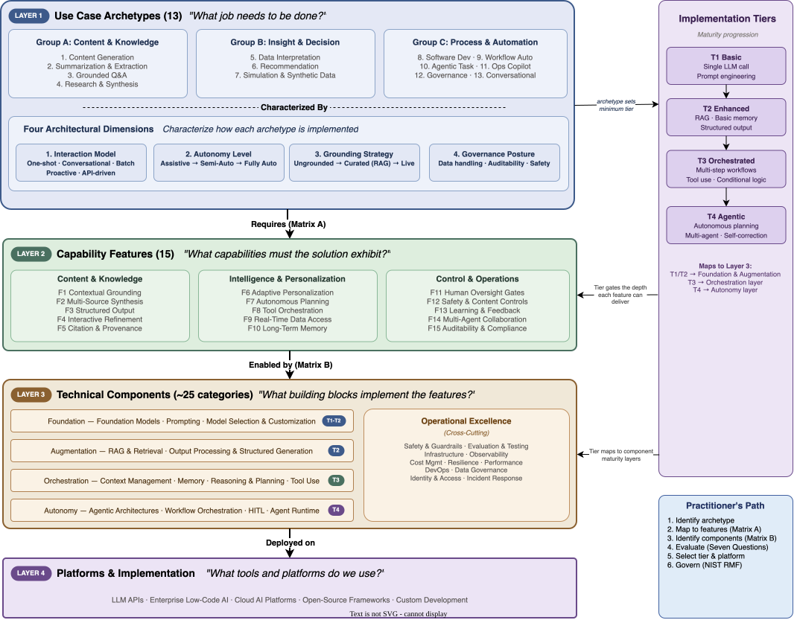
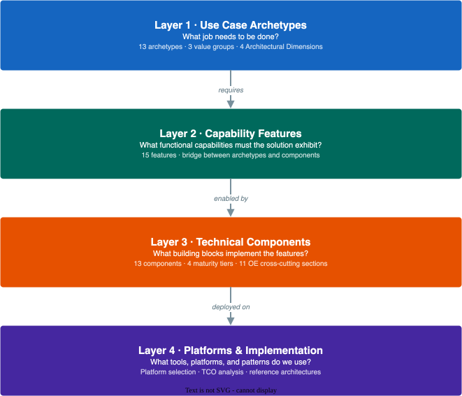
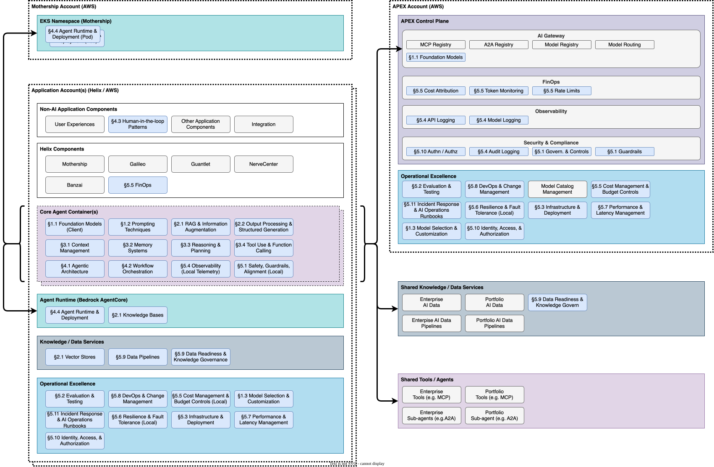

# Diagrams

All diagrams are exported from `.drawio` source files in `original-diagrams/`. Click any image to open it full-size.

Run `make diagrams` to re-export after editing source files.

---

## Framework Overview

### Framework Relationship Overview

The canonical view of how archetypes, features, and components relate across the four tiers.

{ loading=lazy }

---

### The Four-Layer Model

The four-layer chain from business need to implementation: Archetypes → Features → Components → Platforms.

{ loading=lazy }

---

### Agentic Technology Capability Model

A capability model mapping GenAI technology components to agentic system requirements.

{ loading=lazy }

---

!!! tip "Editing diagrams"

    Source files are in `original-diagrams/`. Open them in [diagrams.net](https://app.diagrams.net) or the draw.io desktop app, then re-export:

    ```bash
    make diagrams
    ```
