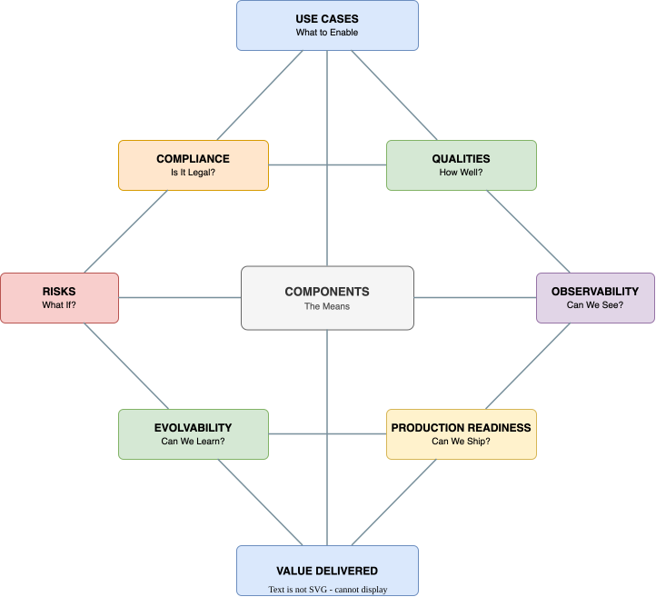

# Component Selection Guide: Purpose-Driven Decision Making

*Version 5.5. Last Updated: 2026-03-03. Aligned with Framework v5.5.*

!!! tip "The Core Principle"

    Technical components are not goals in themselves — they are *instruments* that enable use cases, deliver desired qualities, mitigate anticipated risks, and support the continuous evolution of living systems.


This guide provides evaluation tools for deciding which technical components to include in your GenAI architecture. Use it after identifying your required capability features (Layer 2) and candidate components (Layer 3).

!!! note "Component scope"

    As of Framework v5.5, the component catalog in [04-technical-components.md](technical-components.md) includes 13 capability components across 4 maturity layers plus 11 Operational Excellence cross-cutting sections. The Seven Questions and Canvas apply to all component categories — including the newer additions: Model Selection & Customization Strategy (§1.3), Agent Runtime & Deployment (§4.4), Data Readiness & Knowledge Governance (§5.9), Identity & Authorization (§5.10), and Incident Response (§5.11). For structural prerequisites like Data Readiness Assessment (§5.9.0), the evaluation focuses on Questions 1 (WHY), 3 (WHAT IF), and 7 (CAN WE SHIP) — these are go/no-go prerequisites rather than optional components.


---

## The Extended Value Equation

GenAI systems are **living systems** that must learn, adapt, and evolve. Component selection must account for both design-time and operational concerns:

```
  COMPONENT VALUE = f(
      DESIGN-TIME CONCERNS                    OPERATIONAL CONCERNS
      ─────────────────────                   ──────────────────────
      • Use Case Needs (WHAT to enable?)      • Observability (CAN WE SEE?)
      • Quality Requirements (HOW WELL?)      • Evolvability (CAN WE LEARN?)
      • Risk Profile (WHAT could go wrong?)   • Production Readiness (CAN WE SHIP?)
      • Compliance Needs (WHAT regulations?)
  )
```

---

## The Seven Questions Framework

Every component decision should answer these seven questions across two categories:

### Design-Time Questions (Static Value)

| # | Question | Focus | Example |
|---|----------|-------|---------|
| 1 | **WHY?** | What use case capability does this enable? | "RAG enables Contextual Grounding (F1)" |
| 2 | **HOW WELL?** | What quality attribute does this deliver? | "RAG improves accuracy and reduces hallucination" |
| 3 | **WHAT IF?** | What risk does this mitigate? | "RAG addresses the risk of fabricated facts" |
| 4 | **IS IT LEGAL?** | What compliance requirement does this address? | "Audit logging enables regulatory traceability" |

### Operational Questions (Dynamic Value)

| # | Question | Focus | Example |
|---|----------|-------|---------|
| 5 | **CAN WE SEE?** | Does this enable observability and debugging? | "Tracing enables root cause analysis of failures" |
| 6 | **CAN WE LEARN?** | Does this enable feedback loops and improvement? | "Evaluation datasets enable continuous quality improvement" |
| 7 | **CAN WE SHIP?** | Does this accelerate production readiness? | "Guardrails reduce time-to-production by handling edge cases" |

**The Rule**: Components must demonstrate value in **at least 3 questions** to justify inclusion — with at least **2 design-time** and **1 operational** benefit.

---

## The Architecture Compass

{ loading=lazy }

**The Compass Principle**:
- Components that only address **design-time** concerns create **operational debt**.
- Components that only address **operational** concerns lack **business purpose**.
- The best architectures balance both halves.

---

## Component Selection Canvas v2.0

Use this canvas to evaluate each component decision:

```
┌─────────────────────────────────────────────────────────────────────────────┐
│                   COMPONENT SELECTION CANVAS v2.0                           │
│                                                                             │
│  Component: ___________________________________                             │
│  Candidate for Feature(s): ________________________                         │
│                                                                             │
├─────────────────────────────────────────────────────────────────────────────┤
│  DESIGN-TIME VALUE                                                          │
│                                                                             │
│  1. USE CASE ENABLEMENT (WHY?)                              SCORE: ___/5    │
│     □ Essential    □ High Value    □ Nice to Have    □ Not Needed           │
│     Feature(s) enabled: _____________________________________________       │
│                                                                             │
│  2. QUALITY DELIVERY (HOW WELL?)                            SCORE: ___/5    │
│     □ Accuracy  □ Performance  □ Security  □ Reliability  □ Scalability     │
│     Quality improvement: ____________________________________________       │
│                                                                             │
│  3. RISK MITIGATION (WHAT IF?)                              SCORE: ___/5    │
│     □ Hallucination  □ Security  □ Data Exposure  □ Cost  □ Outage         │
│     Risk reduction: _________________________________________________      │
│                                                                            │
│  4. COMPLIANCE ENABLEMENT (IS IT LEGAL?)                    SCORE: ___/5   │
│     □ Audit Trail  □ Data Privacy  □ Explainability  □ Human Oversight     │
│     Compliance addressed: ___________________________________________      │
│                                                                             │
├─────────────────────────────────────────────────────────────────────────────┤
│  OPERATIONAL VALUE                                                          │
│                                                                             │
│  5. OBSERVABILITY (CAN WE SEE?)                             SCORE: ___/5   │
│     □ Enables tracing  □ Provides metrics  □ Supports debugging            │
│     □ Exposes decision logic  □ Enables root cause analysis                │
│                                                                             │
│  6. EVOLVABILITY (CAN WE LEARN?)                            SCORE: ___/5   │
│     □ Enables feedback loops  □ Supports A/B testing  □ Easy to update     │
│     □ Modular/swappable  □ Supports experimentation                        │
│                                                                             │
│  7. PRODUCTION READINESS (CAN WE SHIP?)                     SCORE: ___/5   │
│     □ Battle-tested  □ Managed options  □ Clear scaling path               │
│     □ Good documentation  □ Active community/support                       │
│                                                                             │
├─────────────────────────────────────────────────────────────────────────────┤
│  COST ASSESSMENT                                                            │
│                                                                             │
│  Implementation: □ Low  □ Med  □ High    Operations: □ Low  □ Med  □ High  │
│  Direct cost:    □ Low  □ Med  □ High    Skills:     □ Low  □ Med  □ High  │
│                                                             COST: ___/5    │
│                                                                             │
├─────────────────────────────────────────────────────────────────────────────┤
│  SCORING                                                                    │
│                                                                             │
│  Design-Time Score  = (Q1 + Q2 + Q3 + Q4) / 4  = _____                    │
│  Operational Score  = (Q5 + Q6 + Q7) / 3       = _____                    │
│  Total Value Score  = Design + Operational       = _____                    │
│  Value/Cost Ratio   = Total Value / Cost        = _____                    │
│                                                                             │
│  DECISION RULES:                                                            │
│  • INCLUDE: Value/Cost > 1.5 AND Design ≥ 2.5 AND Operational ≥ 2.0       │
│  • DEFER:   Value/Cost 1.0-1.5 OR missing operational value                │
│  • EXCLUDE: Value/Cost < 1.0 OR Design < 2.0                               │
│                                                                             │
│  DECISION: □ INCLUDE    □ DEFER    □ EXCLUDE                               │
└─────────────────────────────────────────────────────────────────────────────┘
```

---

## Light Canvas (T1-[T2](implementation-tiers.md#implementation-tiers) Quick Decisions)

For [T1](implementation-tiers.md#implementation-tiers)-[T2](implementation-tiers.md#implementation-tiers) systems with fewer than 10 components, the full Canvas can be overkill. Use this three-question variant for quick component decisions. Reserve the full Canvas v2.0 for [T3](implementation-tiers.md#implementation-tiers)-[T4](implementation-tiers.md#implementation-tiers) systems or formal governance reviews.

```
┌─────────────────────────────────────────────────────────────────────────────┐
│                     LIGHT COMPONENT CANVAS                                  │
│                                                                             │
│  Component: ___________________________________                             │
│                                                                             │
│  1. WHY?  What feature does this enable?  _________________________        │
│           □ Essential  □ High Value  □ Nice to Have  □ Not Needed          │
│                                                                             │
│  2. WHAT IF?  What risk does this mitigate?  ______________________        │
│           □ Critical Risk  □ Important  □ Minor  □ No Risk                 │
│                                                                             │
│  3. CAN WE SHIP?  How production-ready is this?  _________________        │
│           □ Battle-tested  □ Stable  □ Emerging  □ Experimental            │
│                                                                             │
│  DECISION:                                                                  │
│  • INCLUDE: Essential/High Value AND (Critical/Important risk OR Stable+)  │
│  • DEFER:   Nice to Have OR Emerging maturity                               │
│  • EXCLUDE: Not Needed OR Experimental with no risk mitigation             │
│                                                                             │
│  → □ INCLUDE    □ DEFER    □ EXCLUDE                                       │
└─────────────────────────────────────────────────────────────────────────────┘
```

---

## The Feedback Loop Imperative

> *"A GenAI system is not 'set and forget.' Enterprises that invest in active monitoring and feedback loops see a 40%+ reduction in hallucination and critical error rates within three months."*

### The Continuous Improvement Cycle

```
                           ┌─────────────┐
                           │   DEPLOY    │
                           │  (Ship It)  │
                           └──────┬──────┘
                                  │
                                  ▼
    ┌─────────────┐        ┌─────────────┐        ┌─────────────┐
    │   IMPROVE   │◄───────│   OBSERVE   │───────►│   COLLECT   │
    │  (Iterate)  │        │  (Monitor)  │        │ (Feedback)  │
    └──────┬──────┘        └─────────────┘        └──────┬──────┘
           │                      ▲                      │
           │               ┌──────┴──────┐               │
           └──────────────►│  EVALUATE   │◄──────────────┘
                           │  (Measure)  │
                           └─────────────┘

  ENABLING COMPONENTS:
  ├─► OBSERVE:  Tracing, Logging, Metrics, Dashboards
  ├─► COLLECT:  User Feedback, Ratings, Corrections, Escalations
  ├─► EVALUATE: Eval Datasets, Benchmarks, A/B Tests, LLM-as-Judge
  └─► IMPROVE:  Prompt Tuning, RAG Updates, Model Swap, Guardrail Tuning
```

### Components That Enable Learning

| Learning Capability | Required Components | Why Essential |
|---------------------|---------------------|---------------|
| **Detect degradation** | Drift detection, quality metrics | Catch silent failures before users do |
| **Understand failures** | Tracing, error analytics | Root cause analysis for systematic fixes |
| **Capture signal** | Feedback collection, HITL data | Real user preferences, not assumptions |
| **Validate changes** | Eval datasets, A/B testing | Confidence that changes improve outcomes |
| **Iterate quickly** | Prompt versioning, feature flags | Safe experimentation in production |

---

## Evolvability: Designing for Change

| Dimension | What Changes | Component Enablers | Anti-Pattern |
|-----------|--------------|-------------------|--------------|
| **Model Evolution** | New/better LLMs released | Model abstraction, standardized interfaces | Hard-coded model dependencies |
| **Knowledge Evolution** | Information becomes stale | Incremental indexing, version control | Static knowledge bases |
| **Requirement Evolution** | Business needs change | Modular architecture, feature flags | Monolithic designs |
| **Scale Evolution** | Usage grows/shrinks | Auto-scaling, async processing | Fixed capacity assumptions |
| **Regulation Evolution** | New compliance rules | Policy-as-code, audit infrastructure | Hard-coded compliance logic |

### Evolvability Checklist

- [ ] Can we swap the LLM without rewriting the application? (Model abstraction)
- [ ] Can we update the knowledge base without downtime? (Incremental indexing)
- [ ] Can we modify prompts without code deployment? (Prompt management)
- [ ] Can we add new tools without architecture changes? (Pluggable tools)
- [ ] Can we roll back a bad change quickly? (Versioning + feature flags)
- [ ] Can we test changes safely before full rollout? (A/B testing, canary)

**Target: ≥ 4/6 for production systems.**

---

## Production Readiness Levels

```
  LEVEL 0: PROTOTYPE
    Components: LLM API + Basic prompt
    Reality: Works on happy path, fails unpredictably
    Gap: Everything

  LEVEL 1: FUNCTIONAL
    Components: + RAG + Basic error handling + Logging
    Reality: Handles main use cases, limited observability
    Gap: Scale, reliability, compliance, learning

  LEVEL 2: RELIABLE
    Components: + Guardrails + Tracing + Metrics + Fallbacks
    Reality: Handles failures gracefully, debuggable
    Gap: Continuous improvement, compliance maturity

  LEVEL 3: MATURE
    Components: + Eval pipeline + Feedback loops + A/B testing + Compliance
    Reality: Self-improving, compliant, operationally excellent
    Gap: Advanced optimization, full automation

  LEVEL 4: OPTIMIZED
    Components: + Auto-tuning + Drift detection + Cost optimization + Full MLOps
    Reality: Production-grade, continuously improving, cost-efficient
```

---

## Managing Probabilistic Systems

GenAI is inherently probabilistic. This requires different strategies than deterministic software:

| Traditional Approach | GenAI Reality | Component Strategy |
|---------------------|---------------|-------------------|
| "Eliminate all bugs" | Errors are inevitable | Graceful degradation, fallbacks |
| "Same inputs = same outputs" | Outputs vary | Output validation, confidence scoring |
| "Test once, trust forever" | Performance drifts | Continuous evaluation, drift detection |
| "Specification = behavior" | Emergent behavior | Guardrails, behavioral constraints |
| "Debug by reading code" | Black box models | Tracing, explainability layers |

---

## Compliance by Design

| Compliance Domain | Requirements | Component Enablers |
|-------------------|--------------|-------------------|
| **Data Privacy (GDPR, CCPA)** | PII handling, consent, right to deletion | PII filters, retention policies, deletion workflows |
| **AI Transparency (EU AI Act)** | Explainability, human oversight | Reasoning traces, HITL checkpoints, decision audit |
| **Financial Services** | Audit trails, model governance | Comprehensive logging, model versioning, approval workflows |
| **Healthcare (HIPAA)** | Data protection, access control | Encryption, access logs, data isolation |
| **General Enterprise** | Security, audit, access control | AuthN/AuthZ, audit logs, encryption |

---

## Anti-Patterns

| Anti-Pattern | Description | Remedy |
|--------------|-------------|--------|
| **Tech-First Thinking** | "Let's use agents because they're cool" | Start with use case, then select components |
| **Kitchen Sink** | Adding every component "just in case" | Apply the Seven Questions to each component |
| **Quality Blindness** | Ignoring NFRs during selection | Map components to quality requirements |
| **Risk Ignorance** | Not considering what can go wrong | Use risk → component mapping |
| **Copy-Paste Architecture** | Blindly copying another project's stack | Evaluate each component for your context |
| **Set-and-Forget** | Deploying without feedback loops | Build observability and learning from day one |
| **Demo-itis** | Optimizing for impressive demos | Plan for production readiness early |
| **Compliance Afterthought** | "We'll add audit logging later" | Compliance by design from the start |
| **Black Box Acceptance** | No observability into AI decisions | Require tracing and explainability |
| **Monolithic AI** | Tightly coupled, hard to change | Design for evolvability with abstractions |

---

## Quick Reference Checklist

Before adding any component, verify:

### Design-Time Questions
- [ ] **WHY?** Can I name the specific capability feature this enables?
- [ ] **HOW WELL?** Can I name the specific quality attribute this delivers?
- [ ] **WHAT IF?** Can I name the specific risk this mitigates?
- [ ] **IS IT LEGAL?** Does this address any compliance requirements?

### Operational Questions
- [ ] **CAN WE SEE?** Does this improve observability and debugging?
- [ ] **CAN WE LEARN?** Does this enable feedback loops and improvement?
- [ ] **CAN WE SHIP?** Does this accelerate production readiness?

### Validation
- [ ] **3+ Yes Answers**: Value in at least 3 dimensions
- [ ] **Design + Ops Balance**: At least 2 design-time AND 1 operational benefit
- [ ] **Cost Justified**: Value clearly outweighs cost and complexity

**If you can't check at least 5 boxes including validation, reconsider the component.**

---

## Practical Scenarios

### Scenario 1: Customer Support Chatbot

```
Archetype:  Grounded Q&A (#3) + Recommendation (#6)
Features:   F1 Grounding, F4 Refinement, F5 Citation, F6 Personalization,
            F10 Memory, F12 Safety, F13 Feedback

Component Selection:
┌──────────────────────┬────────────────────────────┬───────────────────────────┐
│ Component            │ Design-Time Value          │ Operational Value         │
├──────────────────────┼────────────────────────────┼───────────────────────────┤
│ LLM                  │ ENABLES: F1, F4            │ SHIP: API-ready           │
│ RAG + Vector DB      │ ENABLES: F1                │ EVOLVE: Index updates     │
│                      │ DELIVERS: Accuracy         │                           │
│                      │ MITIGATES: Hallucination   │                           │
│ Memory               │ ENABLES: F4, F10           │ SEE: Session inspection   │
│ Routing              │ DELIVERS: Flexibility      │ EVOLVE: Rule updates      │
│ Escalation (HITL)    │ MITIGATES: Complex issues  │ LEARN: Escalation data    │
│ Content Guardrails   │ DELIVERS: Safety (F12)     │ EVOLVE: Threshold tuning  │
│                      │ COMPLIES: Content policy   │                           │
│ Tracing + Logging    │ COMPLIES: Audit trail      │ SEE: Debug capability     │
│ Feedback Collection  │ —                          │ LEARN: User signal (F13)  │
│ Eval Datasets        │ DELIVERS: Accuracy         │ LEARN: Regression testing │
└──────────────────────┴────────────────────────────┴───────────────────────────┘
```

### Scenario 2: Autonomous Research Agent

```
Archetype:  Research & Synthesis (#4) at T4
Features:   F1 Grounding, F2 Multi-Source, F5 Citation, F7 Planning,
            F8 Tools, F10 Memory, F11 HITL, F13 Feedback, F15 Audit

Component Selection:
┌──────────────────────┬────────────────────────────┬───────────────────────────┐
│ Component            │ Design-Time Value          │ Operational Value         │
├──────────────────────┼────────────────────────────┼───────────────────────────┤
│ ReAct Agent          │ ENABLES: F7                │ SEE: Agent traces         │
│ Tools (Search/Web)   │ ENABLES: F8                │ SEE: Tool call logs       │
│ Agentic RAG          │ DELIVERS: Accuracy (F1)    │ EVOLVE: Index updates     │
│                      │ MITIGATES: Hallucination   │                           │
│ Reasoning Engine     │ DELIVERS: Quality (F2)     │ SEE: Reasoning traces     │
│ Long-term Memory     │ ENABLES: F10               │ EVOLVE: Consolidation     │
│ State + Checkpoint   │ DELIVERS: Reliability      │ SHIP: Recovery patterns   │
│                      │ MITIGATES: Work loss       │                           │
│ HITL Approvals       │ MITIGATES: Bad actions     │ LEARN: Approval data      │
│                      │ COMPLIES: F11, F15         │                           │
│ Full Tracing         │ COMPLIES: Decision audit   │ SEE: End-to-end debug     │
│ Drift Detection      │ —                          │ LEARN: Quality monitoring │
│ A/B Testing          │ —                          │ EVOLVE: Strategy testing  │
└──────────────────────┴────────────────────────────┴───────────────────────────┘
```

---

## Related Documents

- **[01-overview.md](index.md)** — Start here
- **[03-capability-features.md](capability-features.md)** — Layer 2: Identify required features
- **[04-technical-components.md](technical-components.md)** — Layer 3: Component catalog
- **[06-implementation-tiers.md](implementation-tiers.md)** — Maturity tiers and stack patterns

---

## References

- [Nokia Bell Labs: Foundational Design Principles for GenAI-Native Systems](https://arxiv.org/abs/2508.15411)
- [Andreessen Horowitz: Emerging Architectures for LLM Applications](https://a16z.com/emerging-architectures-for-llm-applications/)
- [NIST AI Risk Management Framework](https://www.nist.gov/itl/ai-risk-management-framework)
- [Google Responsible Generative AI Toolkit](https://ai.google.dev/responsible)
- [Martin Fowler: Emerging Patterns in Building GenAI Products](https://martinfowler.com/articles/gen-ai-patterns/)
- [Carnegie Mellon SEI: Architecture Tradeoff Analysis Method](https://en.wikipedia.org/wiki/Architecture_tradeoff_analysis_method)
- [MLOps Principles](https://ml-ops.org/content/mlops-principles)

---

??? note "Version History"

    | Version | Date | Changes |
    |---------|------|---------|
    | 5.5 | 2026-03-03 | Aligned with Framework v5.5. Added component scope note referencing expanded OE catalog (§5.5-§5.11), Data Readiness (§5.9.0/§5.9.5), Model Selection (§1.3), Agent Runtime (§4.4), Identity (§5.10), Incident Response (§5.11). Added Light Canvas for [T1](implementation-tiers.md#implementation-tiers)-[T2](implementation-tiers.md#implementation-tiers) quick decisions. |
    | 3.0 | 2026-02-27 | Refactored from genai-purpose-driven-components.md. Repositioned as evaluation guide (not component taxonomy). Added feature references throughout. Retained Seven Questions, Canvas, anti-patterns, scenarios. |
    | 2.0 | 2026-01-19 | Extended Value Equation with operational concerns. |
    | 1.0 | 2026-01-19 | Initial purpose-driven component selection guide. |

