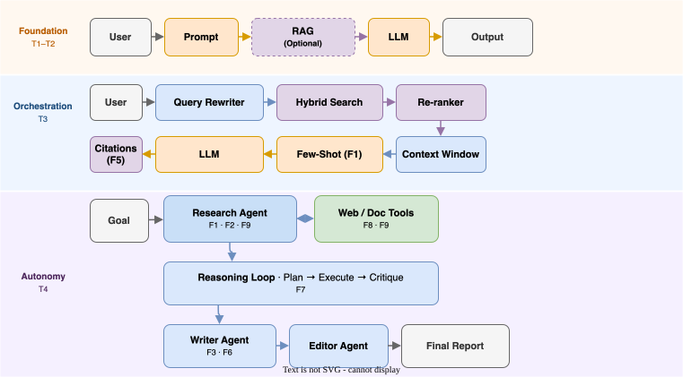
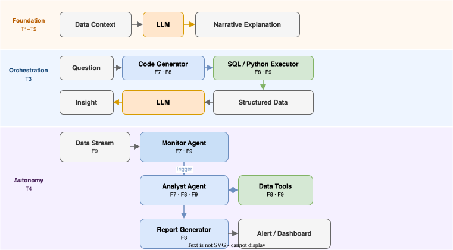
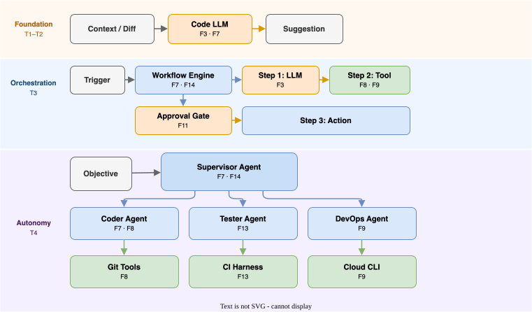
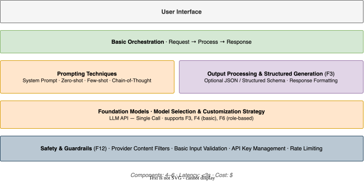
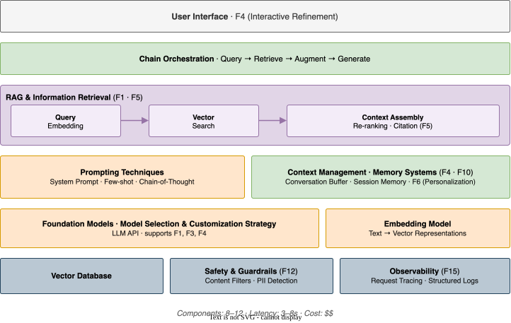
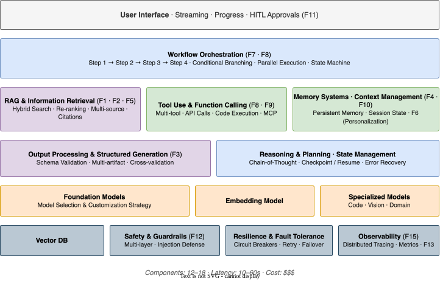
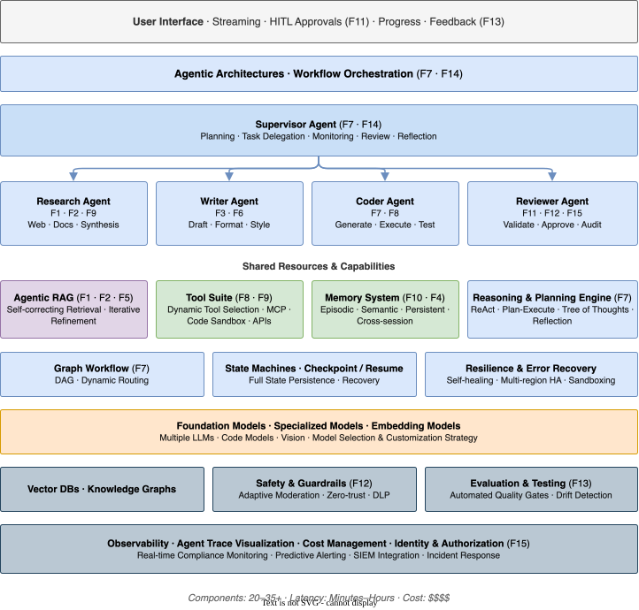
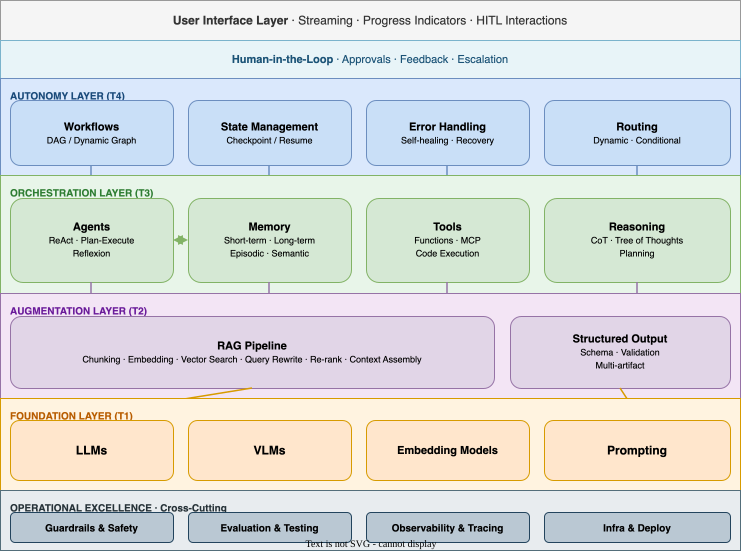

# GenAI Use Case to Technical Component Mapping

*Version 5.5. Last Updated: 2026-03-03. Aligned with Framework v5.5.*

A systematic mapping of use cases to their supporting technical components, organized by implementation complexity tier and maturity layer. This document helps you plan how to build your GenAI solution by connecting your identified archetypes and features to concrete architecture patterns.

---

## How to Use This Document

1. **Start with your archetype and features** — identified via [02-use-case-archetypes.md](use-case-archetypes.md) and [03-capability-features.md](capability-features.md).
2. **Determine your complexity tier (T1-T4)** — using the tier framework below.
3. **Check feature maturity at your tier** — the Feature Maturity by Tier matrix shows what each feature looks like at T1-T4; confirm your tier can deliver the features you need.
4. **Review the NFR requirements** — for your tier.
5. **Explore the component stack** — for your archetype group at your maturity level.
6. **Select a stack pattern** — that matches your tier.
7. **Choose platforms** — via [07-platform-selection.md](platform-selection.md).

---

## 1. Complexity Tier Framework

### Maturity Model Alignment

| Maturity Layer | Focus | Tiers | Key Characteristics |
|----------------|-------|-------|---------------------|
| **Foundation** | Reliable generation & data access | **T1** (Basic), **T2** (Enhanced) | Single LLM calls, zero/few-shot prompts, standard RAG, basic memory. |
| **Orchestration** | State, memory & action | **T3** (Orchestrated) | Multi-step workflows, function calling, tool use, structured reasoning. |
| **Autonomy** | Collaboration & self-improvement | **T4** (Agentic) | Autonomous planning, multi-agent, self-correction, episodic memory. |

### Implementation Tiers

| Tier | Name | Characteristics | Typical Components | Example |
|------|------|-----------------|-------------------|---------|
| **T1** | Basic | Single LLM call, no external data, minimal orchestration | LLM + Prompting | Simple Q&A chatbot |
| **T2** | Enhanced | RAG integration, basic memory, structured output | LLM + RAG + Output Parsing | Knowledge base assistant |
| **T3** | Orchestrated | Multi-step workflows, tool use, conditional logic | LLM + RAG + Tools + Orchestration | Research assistant with web search |
| **T4** | Agentic | Autonomous planning, multi-agent, complex reasoning | Full stack including agents, memory, multi-tool | Autonomous coding assistant |

### Feature Maturity by Tier

This matrix shows **what each capability feature looks like at each tier**. Use it to understand which features are achievable at your chosen tier and what you gain by moving up.

**Legend**: − Not available at this tier | Text describes the maturity level achievable

| Feature | T1 Basic | T2 Enhanced | T3 Orchestrated | T4 Agentic |
|:---|:---|:---|:---|:---|
| **F1** Contextual Grounding | Static context injection | Basic RAG with vector search | Hybrid search + re-ranking + agentic retrieval | Self-correcting retrieval with iterative refinement |
| **F2** Multi-Source Synthesis | − | Retrieve from multiple docs and summarize | Structured synthesis with evaluation gates | Autonomous research with iterative search and self-critique |
| **F3** Structured Output | Basic format instructions | Schema-constrained with validation | Multi-artifact generation with cross-validation | Complex code/document generation with testing |
| **F4** Interactive Refinement | Simple follow-up questions | Full multi-turn with context carry-over | Multi-session memory with preference learning | Proactive clarification and anticipation |
| **F5** Citation & Provenance | − | Document-level citations | Passage-level citations with confidence | Full provenance chain including reasoning steps |
| **F6** Adaptive Personalization | Role-based system prompts | Session-level preference tracking | Persistent user profiles with memory | Adaptive learning with preference evolution |
| **F7** Autonomous Planning | − | Simple chained steps | Conditional workflows with tool use | Full autonomous planning with reflection and recovery |
| **F8** Tool Orchestration | − | Single predetermined tool | Multi-tool with selection logic | Dynamic tool discovery and composition |
| **F9** Real-Time Data Access | − | Single data source queries | Multi-source queries with joins/correlation | Streaming data with anomaly detection and alerting |
| **F10** Long-Term Memory | Stateless | Session memory (conversation buffer) | Persistent memory across sessions | Episodic + semantic memory with consolidation |
| **F11** Human Oversight Gates | Optional review | Approval before send/publish | HITL checkpoints at each critical stage | Graduated autonomy with audit |
| **F12** Safety & Content Controls | Provider content filters | Custom filters + PII detection | Multi-layer filtering + injection defense | Adaptive moderation with adversarial defense |
| **F13** Learning & Feedback | Manual review | User feedback + basic metrics | Continuous evaluation + A/B testing | Automated quality gates + drift detection |
| **F14** Multi-Agent Collaboration | − | − | Handoff between 2 specialized agents | Full multi-agent orchestration with supervisor and shared memory |
| **F15** Auditability & Compliance | Basic request logs | User action + output logging | Full audit trail with reasoning traces | Real-time compliance monitoring + SIEM integration |

**How to read this**: Find the features your archetype requires (from Matrix A in [03-capability-features.md](capability-features.md)), then read across to your target tier. This tells you exactly what level of that feature you can deliver — and whether you need to move up a tier to meet your requirements.

!!! note "Authoritative source"

    This matrix is the authoritative reference for feature maturity by tier. The "Maturity progression" rows in the feature detail cards in [03-capability-features.md](capability-features.md) summarize the same information — if they diverge, this matrix governs.


### Complexity Dimensions

```
                         Low ──────────────────────────────────────► High
FUNCTIONAL DIMENSIONS
Autonomy:             Human-driven │ Assisted │ Semi-autonomous │ Autonomous
Data Integration:     None │ Static Context │ RAG │ Multi-source + Live
Reasoning:            Single-shot │ Chain-of-Thought │ Multi-step │ Planning + Reflection
Tool Use:             None │ Single tool │ Multi-tool │ Dynamic tool selection
Memory:               Stateless │ Session │ Persistent │ Episodic + Semantic
Output:               Free-form │ Templated │ Structured │ Multi-artifact

NON-FUNCTIONAL DIMENSIONS
Security:             Basic API Key │ OAuth + Encryption │ RBAC + Audit │ Zero-trust + DLP
Performance:          Best-effort │ SLA-bound │ Low-latency │ Real-time + Auto-scale
Resilience:           None │ Retry Logic │ Circuit Breakers │ Full HA + DR
Observability:        Basic Logs │ Metrics + Traces │ Full APM │ AI-specific Monitoring
Responsible AI:       Content Filter │ Bias Checks │ Explainability │ Full Governance
Compliance:           Minimal │ Industry Standards │ Regulated │ Mission-critical
```

---

## 2. Non-Functional Requirements by Tier

### NFR Summary Matrix

| NFR Domain | T1 Basic | T2 Enhanced | T3 Orchestrated | T4 Agentic |
|:---|:---|:---|:---|:---|
| **Security** | API keys, TLS, input validation | OAuth/OIDC, encryption at rest, RBAC, PII masking | Fine-grained permissions, full audit trail, injection defense | Zero-trust, dynamic policy, DLP integration, HSM |
| **Performance** | Best effort (<5s) | P95 <3s, response caching | P99 <10s, semantic caching, auto-scaling | Task-appropriate SLAs, ML-driven scaling |
| **Resilience** | Basic retry | Exponential backoff, session recovery | Circuit breakers, automatic failover, checkpoint/resume | Multi-region HA, self-healing, full state persistence |
| **Observability** | Console/file logs | Structured logs, basic metrics, request tracing | Distributed tracing, custom metrics, anomaly detection | Agent trace visualization, predictive alerting |
| **Responsible AI** | Provider content filters | Custom filters, bias testing, citations | Multi-layer filtering, continuous monitoring, HITL | Adaptive moderation, full decision audit, graduated autonomy |
| **Compliance** | Best effort | Industry standards, version tracking | Certified compliance, policy-as-code | Continuous compliance, real-time audit |
| **DevOps** | Manual deploy | CI/CD, dev/prod separation | GitOps, full DTAP, feature flags | Full MLOps, canary/gradual deploys |
| **Cost Mgmt** | API billing | Spending alerts, prompt compression | Hard limits, model cascade | Dynamic budgets, intelligent routing |

### Domain-Specific NFR Considerations

| Domain | Critical NFRs | Regulatory Considerations |
|--------|---------------|---------------------------|
| **Healthcare** | Security (HIPAA), Responsible AI, Compliance | HIPAA, FDA guidance, clinical validation |
| **Financial Services** | Security (PCI-DSS), Compliance (SOX), Resilience | PCI-DSS, SOX, Basel III, FFIEC |
| **Legal** | Compliance (privilege), Security, Audit | Attorney-client privilege, e-discovery |
| **Government** | Security (FedRAMP), Compliance, Data residency | FedRAMP, NIST, data sovereignty |
| **Education** | Privacy (FERPA), Responsible AI | FERPA, COPPA, accessibility |
| **Enterprise General** | Security, Observability, Cost Management | SOC 2, ISO 27001, GDPR |

---

## 3. Component Complexity Ratings

| Category | Component | Stars | Effort |
|----------|-----------|-------|--------|
| **Prompting** | Zero-shot | ★☆☆☆☆ | Hours |
| | Few-shot | ★★☆☆☆ | Hours |
| | Chain-of-Thought | ★★☆☆☆ | Hours |
| | ReAct | ★★★☆☆ | Days |
| | Tree of Thoughts | ★★★★☆ | Days-Weeks |
| **RAG** | Basic RAG | ★★☆☆☆ | Days |
| | Hybrid Search | ★★★☆☆ | Days |
| | Agentic RAG | ★★★★☆ | Weeks |
| | Graph RAG | ★★★★★ | Weeks-Months |
| **Memory** | Conversation Buffer | ★☆☆☆☆ | Hours |
| | Summarization Memory | ★★☆☆☆ | Days |
| | Vector Memory | ★★★☆☆ | Days |
| | Episodic + Semantic | ★★★★★ | Weeks |
| **Tools** | Single Function | ★★☆☆☆ | Hours-Days |
| | Multi-tool | ★★★☆☆ | Days |
| | MCP Integration | ★★★☆☆ | Days |
| | Code Execution | ★★★★☆ | Weeks |
| **Agents** | ReAct Agent | ★★★☆☆ | Days |
| | Plan-Execute | ★★★★☆ | Weeks |
| | Multi-Agent | ★★★★★ | Weeks-Months |
| | Reflexion | ★★★★★ | Weeks-Months |
| **Orchestration** | Sequential Chains | ★★☆☆☆ | Hours-Days |
| | Parallel Execution | ★★★☆☆ | Days |
| | State Machines | ★★★★☆ | Weeks |
| | Dynamic Graphs | ★★★★★ | Weeks |

---

## 4. Detailed Use Case Analysis by Group

### 4.1 Group A: Content & Knowledge Synthesis

*Archetypes: Content Generation, Summarization & Extraction, Grounded Q&A, Research & Synthesis*

#### Maturity Progression

| Layer | Style | Key Components | Example |
|-------|-------|----------------|---------|
| **Foundation (T1-T2)** | Direct generation / Basic RAG. Single-turn, retrieval from static docs. | LLM, Prompting, Vector DB (basic) | "Summarize this PDF" |
| **Orchestration (T3)** | Context-aware / Multi-step. Few-shot for style, hybrid search, citations. | + Few-shot, Hybrid Search, Citations | "Write a report using these 5 docs in our style" |
| **Autonomy (T4)** | Autonomous research. Iterative searching, self-correction, long-form synthesis. | + Research Agent, Web Tools, Planner, Reflection | "Research competitor landscape and write strategic analysis" |

#### Component Stacks

{ loading=lazy }

### 4.2 Group B: Insight & Decision Intelligence

*Archetypes: Data Interpretation, Recommendation, Simulation*

#### Maturity Progression

| Layer | Style | Key Components | Example |
|-------|-------|----------------|---------|
| **Foundation (T1-T2)** | Description. Explaining provided data or charts. | LLM, System Prompt | "Explain this SQL query" |
| **Orchestration (T3)** | Analysis. Querying data tools, code generation for analysis. | + Function Calling (SQL/Python), Structured Output | "Query sales trends and graph them" |
| **Autonomy (T4)** | Exploration. Proactive anomaly detection, hypothesis testing. | + Data Analyst Agent, Code Execution Sandbox | "Monitor for anomalies and investigate root causes" |

#### Component Stacks

{ loading=lazy }

### 4.3 Group C: Process & Task Automation

*Archetypes: Software Dev, Workflow Automation, Agentic Task, Ops Copilot, Governance*

#### Maturity Progression

| Layer | Style | Key Components | Example |
|-------|-------|----------------|---------|
| **Foundation (T1-T2)** | Assistance. Code completion, drafting emails for review. | LLM, Code Models, Copilot Interface | Code autocomplete in IDE |
| **Orchestration (T3)** | Orchestration. Chained workflows, deterministic tool use, HITL. | + Orchestrator, Tools, State Machine | "Run onboarding workflow for user X" |
| **Autonomy (T4)** | Agentic execution. High-level goals, dynamic planning, multi-agent. | + Planning Agents, Multi-Agent, Tool Registry | "Upgrade payment service and migrate database" |

#### Component Stacks

{ loading=lazy }

---

## 5. Component Stack Patterns

### Pattern A: Simple Assistant (T1-T2 / Foundation)

A single LLM call with a well-crafted prompt and optional output formatting. There is no external data retrieval, no persistent memory, and no tool use — the model answers from its training knowledge alone. The entire value proposition rests on prompt quality and model capability.

**When to use**: FAQ bots, content drafting, classification tasks, internal productivity tools where training knowledge is sufficient and factual accuracy is not mission-critical.

**Key risks**: Hallucination with no retrieval backstop; no personalisation beyond the system prompt; no audit trail beyond basic API logs. These are manageable at [T1](implementation-tiers.md#implementation-tiers)–[T2](implementation-tiers.md#implementation-tiers) scale but become blockers as requirements grow.

**Upgrade trigger**: When users start asking questions the model cannot reliably answer from training data, or when you need citations, personalisation, or memory — move to Pattern B.

{ loading=lazy }

---

### Pattern B: RAG-Enhanced Assistant (T2 / Foundation-Augmentation)

Adds a retrieval layer between the user and the model. Queries are embedded, matched against a vector store, and the retrieved context is injected into the prompt before generation. This grounds responses in your documents, reduces hallucination, and enables document-level citations. Conversation memory preserves context across turns.

**When to use**: Knowledge base assistants, customer support with product documentation, internal Q&A over enterprise content, research summarisation over a defined corpus.

**Key design decisions**: Chunking strategy and embedding model quality determine retrieval accuracy more than anything else. Invest in evaluation before tuning the LLM. Add a re-ranker if precision matters. Implement citation tracking ([F5](capability-features.md#f5-citation-provenance)) from day one — retrofitting it is painful.

**Key risks**: Retrieval misses (wrong chunks returned); embedding model staleness; no tool access means the system cannot take actions or query live data.

**Upgrade trigger**: When users need live data, multi-step reasoning, or the system must take actions (send emails, update records, run code) — move to Pattern C.

{ loading=lazy }

---

### Pattern C: Workflow Orchestration (T3 / Orchestration)

Replaces the single LLM call with a directed, multi-step workflow. Each step can invoke a different model, call external tools, branch conditionally, and pause for human approval. State is persisted across steps so long-running processes can resume after failure. This pattern delivers reliable, auditable automation over structured processes.

**When to use**: Business process automation (onboarding, approvals, report generation), research pipelines with web search, coding assistants that run and test code, any use case requiring deterministic sequencing with conditional logic.

**Key design decisions**: Define the workflow graph before choosing components — the graph is the architecture. HITL gates ([F11](capability-features.md#f11-human-oversight-gates)) should be inserted at every step that takes an irreversible external action. Invest in distributed tracing ([F15](capability-features.md#f15-auditability-compliance)) early; debugging multi-step failures without traces is very difficult.

**Key risks**: Workflow complexity grows faster than expected; error recovery and partial-failure handling require careful design; tool permission sprawl if access controls are not established from the start.

**Upgrade trigger**: When the workflow graph itself needs to be decided at runtime, when multiple independent agents need to collaborate in parallel, or when the system must self-correct without human intervention — move to Pattern D.

{ loading=lazy }

---

### Pattern D: Agentic System (T4 / Autonomy)

A supervisor agent decomposes high-level goals into subtasks, delegates to specialist agents, monitors progress, and synthesises results — all without a predefined workflow graph. Agents share a common memory and tool suite, can spawn sub-tasks dynamically, and self-correct when steps fail. This pattern handles open-ended, long-horizon tasks that cannot be reduced to a fixed sequence.

**When to use**: Autonomous coding assistants (plan → code → test → deploy), competitive intelligence agents, complex research synthesis across many sources, multi-domain copilots that coordinate specialists.

**Key design decisions**: The supervisor's planning and reflection capability ([F7](capability-features.md#f7-autonomous-planning-execution)) is the primary quality lever — invest heavily in it. Start with read-only tools and add write-access incrementally with explicit HITL gates ([F11](capability-features.md#f11-human-oversight-gates)). Full agent trace visualisation ([F15](capability-features.md#f15-auditability-compliance)) and cost controls are non-negotiable prerequisites, not afterthoughts. Do not skip to [T4](implementation-tiers.md#implementation-tiers) from [T1](implementation-tiers.md#implementation-tiers)–[T2](implementation-tiers.md#implementation-tiers): the operational maturity built at [T3](implementation-tiers.md#implementation-tiers) (tracing, error recovery, HITL patterns) is what makes agentic systems survivable in production.

**Key risks**: Runaway cost without hard budget controls; agent failure modes are hard to predict; autonomous actions on production systems require zero-trust architecture and sandboxing.

{ loading=lazy }

---

## 6. Component Dependency Graph

{ loading=lazy }

---

## 7. NFR Implementation Checklists

!!! note "Relationship to 04-technical-components.md"

    These checklists provide **tier-specific readiness gates** — what to implement at T1 vs. T4. For **implementation guidance** on each domain (patterns, anti-patterns, and detailed technical decisions), see the corresponding Operational Excellence section in [04-technical-components.md](technical-components.md):

    | NFR Domain (this document) | OE Section (04) |
    |---|---|
    | Security | §5.1 Safety & Guardrails, §5.10 Identity & Authorization |
    | Performance | §5.7 Performance & Latency Management |
    | Resilience | §5.6 Resilience & Fault Tolerance |
    | Observability | §5.4 Observability |
    | DevOps | §5.8 DevOps & Change Management |
    | Cost Management | §5.5 Cost Management & Budget Controls |
    | Compliance | §5.9 Data Readiness & Knowledge Governance, §5.10 Identity, §5.11 Incident Response |


### T1 (Basic)
- [ ] API keys stored securely (not in code)
- [ ] TLS/HTTPS for all API calls
- [ ] Basic input validation
- [ ] Rate limiting configured
- [ ] Timeout and error handling
- [ ] Provider content filters active
- [ ] Basic logging in place
- [ ] API billing monitoring

### T2 (Enhanced) — *includes all T1*
- [ ] OAuth 2.0 / SSO integration
- [ ] Data encryption at rest
- [ ] RBAC implemented
- [ ] PII detection/masking
- [ ] Secrets management
- [ ] P95 latency targets defined
- [ ] Response caching
- [ ] Retry with exponential backoff
- [ ] Structured logging + basic metrics
- [ ] Request tracing enabled
- [ ] Custom content filters
- [ ] Source citations implemented
- [ ] CI/CD pipeline
- [ ] Prompt version control
- [ ] Spending alerts

### T3 (Orchestrated) — *includes all T2*
- [ ] Fine-grained permissions + full audit trail
- [ ] Prompt injection defenses
- [ ] P99 latency targets monitored
- [ ] Semantic caching + auto-scaling
- [ ] Circuit breakers + automatic failover
- [ ] Checkpoint/resume for workflows
- [ ] Distributed tracing across steps
- [ ] Anomaly detection alerting
- [ ] Multi-layer content filtering
- [ ] HITL checkpoints at critical stages
- [ ] Industry compliance certifications
- [ ] Policy-as-code enforcement
- [ ] GitOps + feature flags
- [ ] Model cascade / selection strategy

### T4 (Agentic) — *includes all T3*
- [ ] Zero-trust architecture
- [ ] Dynamic policy enforcement + DLP integration
- [ ] Agent action sandboxing
- [ ] Task-appropriate SLAs
- [ ] Multi-region HA + self-healing
- [ ] Full state persistence and recovery
- [ ] Agent trace visualization
- [ ] Predictive alerting + quality gates
- [ ] Adaptive moderation + graduated autonomy
- [ ] Full decision audit trail + provenance
- [ ] Continuous compliance monitoring
- [ ] Full MLOps pipeline
- [ ] Canary/gradual deployments
- [ ] Dynamic budgets + intelligent routing

---

## 8. Quick Reference: Starter Configurations

| Use Case | Min Tier | Core Stack | Key Additions |
|----------|----------|------------|---------------|
| FAQ Chatbot | T1 | LLM + System Prompt | + RAG for knowledge base |
| Content Writer | T1 | LLM + Few-shot | + Templates + Style memory |
| Research Assistant | T2 | LLM + RAG | + Web search + Multi-source |
| Code Assistant | T2 | Code LLM + Context | + File tools + Execution |
| Customer Support | T2 | LLM + RAG + Memory | + Handoff + Analytics |
| Data Analyst | T2 | LLM + SQL Tools | + Visualization + Iteration |
| Virtual Assistant | T3 | LLM + Tools + Memory | + Proactive + Multi-domain |
| Autonomous Coder | T4 | Full Agent Stack | + Git + CI/CD + Review |
| Research Agent | T4 | Full Agent Stack | + Web + Synthesis + Iteration |

---

## 9. Upgrading an Existing System

Most teams are not starting greenfield — they have a running T1 or T2 system and want to add capabilities. Tier upgrades are not simple feature additions; they introduce architectural changes that affect the entire stack.

### Assessing Your Current Tier

Map your existing system against the tier characteristics in §1:

| Signal | You're At |
|---|---|
| Single LLM call, no retrieval, no tools | T1 |
| RAG in place, basic memory, structured output | T2 |
| Multi-step workflows, tool use, conditional logic, HITL gates | T3 |
| Autonomous planning, multi-agent, self-correction | T4 |

If you straddle two tiers (e.g., RAG + one tool but no workflow orchestration), you're at the lower tier with a partial step toward the next.

### What Changes When Moving Up

| Upgrade | New Components Required | New NFRs Required | Common Pitfalls |
|---|---|---|---|
| **T1 → T2** | RAG pipeline, vector DB, embedding model, conversation memory, output parsing | Structured logging, request tracing, PII detection, CI/CD, spending alerts | Underestimating chunking/embedding quality; skipping evaluation pipeline |
| **T2 → T3** | Workflow orchestration, tool integration, state management, HITL checkpoints, error recovery | Distributed tracing, circuit breakers, fine-grained permissions, prompt injection defense, policy-as-code | Retrofitting observability across steps; missing human oversight gates for tool actions; tool permission sprawl |
| **T3 → T4** | Planning engine, agent runtime, multi-agent coordination, shared memory, dynamic tool selection | Zero-trust architecture, agent sandboxing, full state persistence, predictive alerting, graduated autonomy | Underestimating agent failure modes; runaway cost without budget controls; insufficient kill-switch infrastructure |

### Upgrade Principles

1. **Retrofit the OE layer first** — Before adding agentic capabilities to a T2 system, ensure the T3 NFR checklist (§7) is satisfied. Observability, error handling, and security gaps become critical failures at higher tiers.
2. **Add evaluation before adding autonomy** — If you don't have a golden dataset and evaluation pipeline, build those before adding autonomous planning. You cannot safely grant autonomy to a system you cannot measure.
3. **Expand the action space incrementally** — Don't give a new agent access to all tools at once. Start with read-only tools, validate behavior, then add write tools one at a time with explicit human approval gates.
4. **Budget for data readiness** — Higher tiers typically require richer data. Moving to T3 tool use requires documented API schemas. Moving to T4 multi-agent requires shared memory infrastructure. Run the Data Readiness Gate (02-use-case-archetypes.md, Part 5) against the new tier's requirements.
5. **Don't skip tiers** — A jump from T1 to T4 is almost always a project failure. Each tier builds operational maturity that the next tier depends on.

---

## Related Documents

- **[01-overview.md](index.md)** — Start here
- **[03-capability-features.md](capability-features.md)** — Layer 2: Features and mapping matrices
- **[04-technical-components.md](technical-components.md)** — Layer 3: Component catalog
- **[05-component-selection-guide.md](component-selection-guide.md)** — Evaluation tools
- **[07-platform-selection.md](platform-selection.md)** — Platform comparison and TCO

---

??? note "Version History"

    | Version | Date | Changes |
    |---------|------|---------|
    | 5.5 | 2026-03-03 | Aligned with Framework v5.5. Added NFR↔OE cross-reference mapping table at §7 linking each NFR domain to its corresponding OE section in 04-technical-components.md. Added §9 Upgrading an Existing System (brownfield guidance: tier assessment, upgrade requirements, principles). Added authoritative source note to Feature Maturity by Tier matrix. |
    | 4.0 | 2026-02-27 | Refactored: extracted platform selection (Sections 7.0-7.13) to separate document. Harmonized layer terminology. Replaced 15-column matrix with two-matrix approach in capability-features.md. Retained maturity progressions, stack patterns, NFR framework, and checklists. |
    | 3.0 | 2026-01-18 | Added platform selection guide. |
    | 2.0 | 2026-01-18 | Added NFR framework. |
    | 1.0 | 2026-01-17 | Initial mapping document. |

