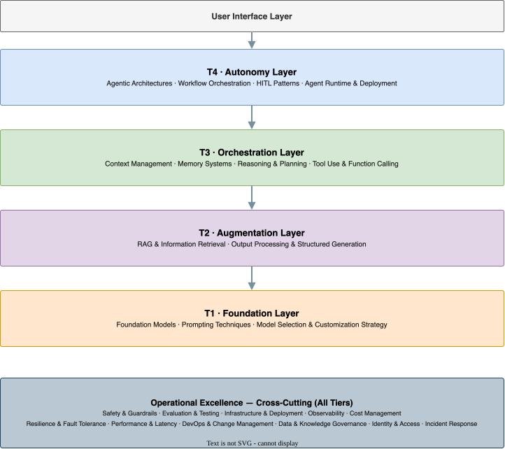

# Technical Components of Generative AI & Agentic AI Solutions

*Version 5.5. Last Updated: 2026-03-03*

A comprehensive catalog of the technical building blocks that comprise modern GenAI and Agentic AI systems. This document is the Layer 3 reference for the GenAI & Agentic Architecture Framework.

**Scope**: This document catalogs *what* each component is and *what it does*, with guidance on when to use each variant. For *how* to combine components into stack patterns at different maturity tiers, see [06-implementation-tiers.md](implementation-tiers.md). For *whether* to include a component, see [05-component-selection-guide.md](component-selection-guide.md). For *which features* each component enables, see Matrix B in [03-capability-features.md](capability-features.md) — the authoritative detailed mapping. The appendix here summarizes primary (:material-circle:) relationships only.

**How to use this document**: After identifying your required capability features (Layer 2), use this catalog to understand the technical components that enable those features. Each component category links back to the features it supports.

---

## Component Architecture Overview

Components are organized into four progressive maturity layers plus cross-cutting Operational Excellence concerns:

{ loading=lazy }

!!! note "Note on layer assignment"

    Layer labels reflect where a component's core complexity lives. Many components span tiers — for example, Agentic Prompting (§1.2.4) lives in the Foundation Layer but applies at [T3](implementation-tiers.md#implementation-tiers)-[T4](implementation-tiers.md#implementation-tiers). For component maturity by tier, see the Feature Maturity matrix in [06-implementation-tiers.md](implementation-tiers.md). For component interdependencies and dependency graphs, see §6 of [06-implementation-tiers.md](implementation-tiers.md).

### Section Index

| § | Section | Subsections |
|---|---------|-------------|
| **1** | **Foundation Layer** | |
| 1.1 | Foundation Models | Model Types · Architectures · Adaptation · Optimization |
| 1.2 | Prompting Techniques | Basic · Reasoning · Decomposition · Agentic · Advanced · Optimization · Role & Persona |
| 1.3 | Model Selection & Customization Strategy | Selection Dimensions · Customization Ladder · Evaluation Methodology · Fine-Tuning · Distillation |
| **2** | **Augmentation Layer** | |
| 2.1 | RAG & Information Retrieval | RAG Patterns · Architectures · Vector Storage · Document Processing · Knowledge Integration |
| 2.2 | Output Processing & Structured Generation | Structured Output · Constraints · Parsing & Validation · Enhancement |
| **3** | **Orchestration Layer** | |
| 3.1 | Context Management | Context Window Strategies · Information Prioritization · Multi-Turn Management |
| 3.2 | Memory Systems | Short-Term · Long-Term · Management · Shared & Distributed |
| 3.3 | Reasoning & Planning | Reasoning Types · Planning Approaches · Advanced Reasoning |
| 3.4 | Tool Use & Function Calling | Function Calling · Tool Types · Integration Patterns · Code Execution |
| **4** | **Autonomy Layer** | |
| 4.1 | Agentic Architectures | Single-Agent Patterns · Multi-Agent Systems · Agent Components · Agent Frameworks |
| 4.2 | Workflow Orchestration | Flow Patterns · Graph-Based · State Management · Error Handling |
| 4.3 | Human-in-the-Loop Patterns | Interaction Modes · Escalation Patterns · User Experience |
| 4.4 | Agent Runtime & Deployment | Hosting Patterns · Session Lifecycle · Compute & Isolation · Managed vs. Self-Hosted |
| **5** | **Operational Excellence (Cross-Cutting)** | |
| 5.1 | Safety, Guardrails & Alignment | Input Guardrails · Output Guardrails · Alignment · Security |
| 5.2 | Evaluation & Testing | Types · Metrics · Testing Strategies · Testability by Design |
| 5.3 | Infrastructure & Deployment | Model Serving · API Management · Caching · Cost Optimization |
| 5.4 | Observability | Deep Tracing · Monitoring · Logging · Analytics & Alerting |
| 5.5 | Cost Management & Budget Controls | Budget Guardrails · Cost Attribution · Model Economics · Spend Observability |
| 5.6 | Resilience & Fault Tolerance | Multi-Provider Failover · Graceful Degradation · State Recovery · Agent Failure Modes |
| 5.7 | Performance & Latency Management | Latency Budgeting · Parallelism · Throughput · Perceived Performance |
| 5.8 | DevOps & Change Management | Prompt Versioning · Model Lifecycle · AI-Native CI/CD · Safe Deployment |
| 5.9 | Data Readiness & Knowledge Governance | **Data Readiness Assessment** · Corpus Lifecycle · Data Quality Pipelines · PII & Sensitive Data · Index Operations · **Structured Data Readiness** |
| 5.10 | Identity, Access & Authorization | Model Access Controls · Agent Authorization · Credential Management · Multi-Tenant Isolation |
| 5.11 | Incident Response & AI Operations Runbooks | Incident Classification · Kill Switches · Post-Incident Analysis · Operational Playbooks |

---

## 1. Foundation Layer

*Tier: [T1](implementation-tiers.md#implementation-tiers) (Basic). Focus: Reliable generation, data access, and model selection.*
*Primarily Enables Features: F1 (Contextual Grounding), F2 (Multi-Source Synthesis), F3 (Structured Output), F4 (Interactive Refinement), F6 (Adaptive Personalization), F7 (Autonomous Planning)*
*Approximate cost baseline: $ (LLM API calls — the cost floor for all solutions)*

### 1.1 Foundation Models

#### 1.1.1 Model Types

- **Large Language Models (LLMs)** — Text-to-text generation, instruction-following, chat-optimized, code-specialized. *Use for: the vast majority of GenAI use cases; the default starting point.*
- **Vision-Language Models (VLMs)** — Image understanding, generation, editing, visual Q&A. *Use for: document processing with images/diagrams, visual content analysis, multimodal customer support.*
- **Diffusion Models** — High-fidelity image/video generation, latent diffusion. *Use for: creative content generation, product visualization, synthetic data generation (images).*
- **Multimodal Models** — Text + Image + Audio, video understanding, document understanding (OCR + reasoning). *Use for: rich document processing, video analysis, any task mixing modalities.*
- **Speech Models** — Speech-to-text (ASR), text-to-speech (TTS), voice cloning, real-time voice agents. *Use for: voice interfaces, call center automation, accessibility features, conversational agents.*
- **Embedding Models** — Text, image, multimodal, and code embeddings. *Use for: semantic search, RAG pipelines, similarity matching, clustering — not generation.*

#### 1.1.2 Model Architectures

- **Transformer-based** — Encoder-only (BERT-style for classification/retrieval), Decoder-only (GPT-style for generation), Encoder-decoder (T5-style for translation/summarization)
- **Mixture of Experts (MoE)** — Sparse activation, expert routing. *Advantage: large capacity at lower inference cost per token.*
- **State Space Models** — Mamba architecture, linear attention variants. *Advantage: efficient for very long sequences; alternative to transformers for specific workloads.*
- **Hybrid Architectures** — Transformer + retrieval, Transformer + diffusion

#### 1.1.3 Model Adaptation

- **Fine-tuning** — Full fine-tuning (high cost, high control), PEFT (LoRA, QLoRA, Adapters, Prefix tuning, Prompt tuning — preferred for most production use cases), Instruction tuning, Domain adaptation
- **Alignment Training** — RLHF, DPO, Constitutional AI, RLAIF. *Use for: behavioral alignment, safety tuning, preference optimization.*
- **Distillation** — Knowledge distillation, model compression, teacher-student training. *Use for: cost reduction; producing smaller, faster models that inherit capability from larger ones.*

#### 1.1.4 Model Optimization

- **Quantization** — INT8/IN[T4](implementation-tiers.md#implementation-tiers), GPTQ, AWQ, GGML/GGUF, mixed-precision. *Primary lever for reducing inference cost and latency in self-hosted deployments.*
- **Pruning** — Structured and unstructured. *Use with caution: can degrade quality; measure carefully before production.*
- **Speculative Decoding** — Draft model acceleration, parallel token generation. *Use for: latency-sensitive applications where output quality cannot be sacrificed for throughput.*

### 1.2 Prompting Techniques

#### 1.2.1 Basic Prompting

- **Zero-Shot** — Direct instruction without examples. *Use for: well-understood tasks with capable models; fastest to iterate.*
- **One-Shot / Few-Shot** — 1 or 2-10 examples for in-context learning, example selection strategies. *Use for: format consistency, domain-specific style, tasks where zero-shot quality is insufficient.*

#### 1.2.2 Reasoning Prompts

- **Chain-of-Thought (CoT)** — Step-by-step reasoning, few-shot and zero-shot variants. *Use for: math, logic, multi-step analysis; significant quality gains for reasoning tasks.*
- **Self-Consistency** — Multiple reasoning paths with majority voting. *Use for: high-stakes answers where variance reduction matters; increases cost proportionally.*
- **Tree of Thoughts (ToT)** — Branching paths with exploration and backtracking. *Use for: complex planning and creative problem-solving where exploration of alternatives is valuable (T3-[T4](implementation-tiers.md#implementation-tiers)).*
- **Graph of Thoughts (GoT)** — Non-linear reasoning structures, thought combination. *Use for: highly complex problems requiring non-linear reasoning (research/experimental).*
- **Skeleton-of-Thought** — Outline-first generation with parallel expansion. *Use for: long-form structured content where parallel generation reduces latency.*

#### 1.2.3 Decomposition Prompts

- **Least-to-Most** — Problem decomposition, sequential sub-problem solving. *Use for: problems where simpler sub-tasks unlock harder ones.*
- **Decomposed Prompting (DecomP)** — Sub-task delegation, modular problem solving
- **Plan-and-Solve** — Explicit planning phase then structured execution. *Use for: multi-step tasks where an explicit plan reduces errors in execution.*

#### 1.2.4 Agentic Prompting *(T3-[T4](implementation-tiers.md#implementation-tiers))*

*These techniques are defined here as prompting patterns but require agent infrastructure (§4.1) to fully realize.*

- **ReAct** — Interleaved reasoning + action with tool integration. *Use for: the default agentic pattern; best balance of transparency and effectiveness.*
- **Reflexion** — Self-reflection and iterative improvement with episodic memory. *Use for: tasks requiring quality improvement through self-critique and retry.*
- **REWOO** — Reasoning without observation, planned tool use upfront. *Use for: reducing latency by planning all tool calls before execution; requires predictable tool outcomes.*

#### 1.2.5 Advanced Techniques

- **Prompt Chaining** — Sequential execution, output-to-input linking
- **Meta-Prompting** — Prompts that generate/optimize prompts
- **Generated Knowledge Prompting** — Knowledge generation before answering
- **Automatic Prompt Engineering (APE)** — Automated optimization
- **Contrastive Prompting** — Positive/negative examples for boundary definition

#### 1.2.6 Prompt Optimization

- **Prompt Compression** — Token reduction (LLMLingua and variants). *Use for: reducing cost/latency in long-context applications.*
- **Prompt Caching** — Prefix caching, KV-cache reuse. *Use for: applications with a fixed system prompt and many users — significant cost reduction.*
- **Dynamic Prompting** — Context-aware prompt selection, adaptive few-shot selection

#### 1.2.7 Role & Persona

- **System Prompts** — Persona definition, behavioral constraints, output formatting
- **Role-Playing** — Expert personas, domain specialization
- **Multi-Persona** — Debate/discussion formats, perspective synthesis

### 1.3 Model Selection & Customization Strategy

*Model choice is the single highest-leverage architectural decision in a GenAI system. The wrong model, or the wrong level of customization, wastes resources and produces poor outcomes regardless of how well everything else is built. This component provides the decision framework for selecting foundation models and determining how much customization is needed — before building. For model lifecycle management after selection (versioning, upgrades, drift), see §5.8.2.*

*Primarily Enables: All features — model selection sets the capability ceiling for every feature in the stack.*

#### 1.3.1 Selection Dimensions

*Evaluate candidate models across five dimensions. The relative weight of each is determined by your use case.*

- **Capability** — Does the model achieve acceptable quality on your specific task? Use-case-specific evaluation (§1.3.3) is the only reliable measure; public benchmark scores are leading indicators, not guarantees of production quality on your task distribution.
- **Cost & Efficiency** — Total cost per request (input + output tokens + infrastructure); cost differences between model tiers can be 10–100×. Model cost must be evaluated at target production volume, not per-request in isolation.
- **Latency** — Time-to-first-token (TTFT) and total generation time at p50/p95 under production load. For real-time user-facing applications, latency may override capability as the primary selection constraint.
- **Data Privacy & Residency** — Does sending data to this model violate data residency, regulatory, or contractual requirements? Some use cases require self-hosted or on-prem models even at higher cost regardless of capability.
- **Deployment Constraints** — API-only frontier models (Anthropic, OpenAI, Google) vs. open-weight self-hosted models (Llama, Mistral, Gemma, Qwen) have fundamentally different operational profiles; deployment environment must be a first-class input to model selection.

#### 1.3.2 The Customization Ladder

*Start at step 0. Move to the next step only when the current step demonstrably fails to meet your quality target. Each step up adds complexity, data requirements, and maintenance burden.*

| Step | Approach | Move Up When... | Data Required |
|------|----------|--------------------|---------------|
| **0** | Zero-shot prompting | Output quality is insufficient even with clear instructions | None |
| **1** | Few-shot prompting | Format, style, or domain phrasing is inconsistent | 5–20 curated examples |
| **2** | Prompt engineering + system prompts | Behavioral or output structure needs explicit constraints | None |
| **3** | RAG / contextual grounding | Task requires domain knowledge the model lacks or knowledge changes frequently | Domain corpus |
| **4** | Fine-tuning (PEFT / LoRA) | Steps 0–3 don't meet quality targets; task distribution is stable and well-defined | 100–10,000+ labeled examples |
| **5** | Full fine-tuning / instruction tuning | Deep behavioral change needed; large high-quality data budget available | 10,000–1M+ examples |
| **6** | Distillation | A large fine-tuned model meets quality but is too expensive or slow for production | Teacher model outputs |
| **7** | Continued pretraining | Domain is so specialized it is underrepresented in all public training data | Millions of domain documents |

!!! note "Anti-pattern"

    Jumping to fine-tuning before exhausting steps 0–3. Fine-tuning a model on a task that could be solved with better prompting + RAG is expensive, requires labeled data collection, creates a model maintenance burden, and often underperforms RAG on knowledge-intensive tasks.

#### 1.3.3 Use-Case Evaluation Methodology

*Public benchmarks (MMLU, GSM8K, HumanEval, AgentBench) measure general capability on standardized tasks. Production model selection requires evaluation on your specific task distribution. A model that tops a public leaderboard can underperform a smaller model on your actual use case.*

- **Golden Dataset Construction** — Before selecting a model, build a representative evaluation set of 50–500 input/output pairs sampled from your actual task distribution. This dataset becomes the model selection benchmark and the ongoing regression test suite.
- **Head-to-Head Comparison** — Run all candidate models against the same golden dataset; score with automated metrics (task-specific) and LLM-as-Judge; select the best task-specific quality-per-dollar model on the cost-quality frontier.
- **Failure Mode Analysis** — Don't only measure average quality; analyze where each model fails systematically. Systematic failure on a specific query type or edge case often reveals a capability gap that average metrics mask.
- **Cost-Quality Frontier** — Plot candidates on a cost vs. quality scatter plot; models below the frontier (same quality, higher cost) are dominated choices; select from the frontier based on your cost/quality priority.
- **Latency-Realistic Testing** — Test latency under representative concurrent load, not single-request latency. Model API latency can degrade significantly under load, and results differ by model and provider.

#### 1.3.4 Fine-Tuning Patterns

*Use only after confirming that prompting + RAG (steps 0–3) is insufficient for your quality target.*

- **PEFT / LoRA** — Parameter-efficient fine-tuning; adapts a small adapter layer while freezing the base model weights. *Preferred for most production fine-tuning: 10–100× cheaper than full fine-tuning, comparable quality for most task-specific adaptations.* Variants: LoRA, QLoRA (quantized, lower memory), Adapters, Prefix Tuning.
- **Instruction Tuning** — Train on (instruction, response) pairs to align the model to follow task-specific instructions reliably. *Use for: standardizing output format, behavioral consistency, domain-specific task performance.*
- **Domain Adaptation** — Continue pre-training on domain-specific text to improve vocabulary, terminology, and knowledge coverage for highly specialized domains (legal, medical, scientific, financial).
- **Preference Optimization (RLHF / DPO / RLAIF)** — Alignment training using human or AI preference data. *Use for: output quality optimization, behavioral alignment, safety tuning. Prefer DPO over RLHF for lower implementation complexity.*
- **Data quality over quantity** — 1,000 high-quality, diverse, correctly-labeled examples typically outperform 100,000 noisy examples. Invest in data curation before data volume.

#### 1.3.5 Distillation Strategy

*Distillation produces a smaller, faster, cheaper student model that mimics a larger teacher model's behavior on a specific task. Use when a fine-tuned large model meets quality targets but is too expensive or slow for production volume.*

- **Task-Specific Distillation** — Generate a large synthetic training set by running your production inputs through the teacher model; fine-tune the student on these teacher-generated outputs. *Most practical path for LLM distillation; the student only needs to learn the target task distribution, not all capabilities of the teacher.*
- **Knowledge Distillation** — Train the student to match the teacher's output probability distribution (soft labels), not just the final answer. *Transfers more nuance than training on hard labels alone; typically produces higher-quality students.*
- **Progressive Distillation** — Distill in stages (large → medium → small) to preserve more capability at each step when the quality gap between sizes is large.
- **When to distill vs. fine-tune a smaller model directly** — Distillation is most valuable when the task is complex enough that a smaller model cannot learn it from human labels alone, but the teacher model's behavior provides a rich training signal that the student can approximate.
- **Ceiling** — A distilled student cannot exceed the teacher's quality on the distillation task. If the teacher doesn't meet your quality bar, distillation will not either.

---

## 2. Augmentation Layer

*Tier: [T2](implementation-tiers.md#implementation-tiers) (Enhanced). Focus: Knowledge augmentation and output fidelity.*
*Primarily Enables Features: F1 (Contextual Grounding), F2 (Multi-Source Synthesis), F3 (Structured Output), F5 (Citation & Provenance)*
*Approximate cost: $$ (adds embedding + vector DB hosting + document processing to baseline)*

### 2.1 Information Augmentation & Retrieval (RAG)

#### 2.1.1 RAG Patterns

- **Basic RAG** — Query → Retrieve → Generate (single-step). *Use for: prototyping and simple Q&A where precision requirements are low (T1-[T2](implementation-tiers.md#implementation-tiers)).*
- **Advanced RAG** — Pre-retrieval optimization (query rewriting, decomposition, HyDE), Retrieval optimization (hybrid search, re-ranking, contextual compression), Post-retrieval optimization (filtering, scoring, reordering). *Use for: production systems where retrieval quality directly impacts answer quality (T2-[T3](implementation-tiers.md#implementation-tiers)).*

#### 2.1.2 RAG Architectures

- **Naive RAG** — Simple retrieve-and-generate. *Use for: prototyping, small document sets, internal tools with low precision requirements (T1-[T2](implementation-tiers.md#implementation-tiers)).*
- **Modular RAG** — Pluggable components, flexible pipelines. *Use for: production systems needing independently upgradeable retrieval stages (T2-[T3](implementation-tiers.md#implementation-tiers)).*
- **Agentic RAG** — Tool-based retrieval, iterative and self-correcting. *Use for: complex queries requiring multiple retrieval passes and adaptive search strategy (T3-[T4](implementation-tiers.md#implementation-tiers)).*
- **Graph RAG** — Knowledge graph integration, entity-relationship retrieval. *Use for: domains with rich entity relationships and multi-hop reasoning needs (e.g., legal, compliance, enterprise knowledge) (T3-[T4](implementation-tiers.md#implementation-tiers)).*
- **Multi-Modal RAG** — Cross-modal search (image + text). *Use for: document understanding with mixed content — technical diagrams, product catalogs, medical imaging (T2+).*

#### 2.1.3 Vector Storage & Search

- **Vector Databases** — Purpose-built (Pinecone, Weaviate, Qdrant, Milvus, Chroma), Integrated (PostgreSQL/pgvector, Elasticsearch)
- **Indexing Algorithms** — HNSW (fast approximate search), IVF (scalable for large corpora), Product/Scalar Quantization (cost reduction)
- **Search Types**:
  - **Dense** (embedding similarity) — *Use for: semantic/conceptual queries; default for most RAG*
  - **Sparse** (BM25, TF-IDF) — *Use for: keyword-specific queries; proper nouns, codes, IDs that semantic search misses*
  - **Hybrid** — *Use for: production systems; recommended default — combines semantic and keyword strengths*
  - **Filtered** — *Use for: access control; ensuring results respect user permissions and data classifications*
  - **Multi-vector** — *Use for: long documents or multimodal content requiring multiple embeddings per item*

#### 2.1.4 Document Processing

- **Chunking Strategies** — Fixed-size (simple, consistent), semantic (content-aware boundaries), recursive (hierarchical), document-structure aware (headers/sections), agentic (LLM-guided), parent-child (retrieval granularity with generation context)
- **Document Parsing** — PDF extraction, HTML/web scraping, table extraction, image/diagram processing
- **Metadata Extraction** — Automatic tagging, entity extraction, relationship extraction. *Critical for filtered search and access control.*

#### 2.1.5 Knowledge Integration

- **Knowledge Graphs** — Entity-relationship modeling, graph databases (Neo4j), ontology integration. *Use for: domains where relationship traversal is as important as text retrieval.*
- **Structured Data Integration** — SQL/database querying, API integration, schema understanding. *Bridge between unstructured RAG and real-time data access (F9).*

### 2.2 Output Processing & Structured Generation

#### 2.2.1 Structured Output

- **JSON Generation** — Schema-constrained, nested structures
- **Code Generation** — Syntax-valid code, multi-file generation
- **Structured Data** — Tables, lists, key-value pairs

#### 2.2.2 Output Constraints

- **Grammar-Based** — CFG, regular expressions. *Use for: strict format enforcement at token level.*
- **Schema Validation** — JSON Schema, Pydantic models, TypeScript types. *Use for: production systems consuming LLM output programmatically.*
- **Constrained Decoding** — Token-level constraints, guided generation. *Use for: guaranteed format compliance when schema validation alone isn't sufficient.*

#### 2.2.3 Output Parsing & Validation

- **Format Extraction** — XML/JSON parsing, code block extraction
- **Entity Extraction** — Named entities, structured data
- **Validation & Repair** — Syntax correction, schema conformance. *Build repair loops for production: validate → if invalid, retry with error context → escalate if still failing.*

#### 2.2.4 Output Enhancement

- **Formatting** — Markdown rendering, code highlighting
- **Citation & Attribution** — Source linking, reference tracking. *Implementation of F5; link specific text spans to source chunks, not just documents.*
- **Streaming** — Token-by-token output, partial response handling. *Critical for perceived latency in conversational and long-form generation use cases.*

---

## 3. Orchestration Layer

*Tier: [T3](implementation-tiers.md#implementation-tiers) (Orchestrated). Focus: State, memory, reasoning, and action.*
*Primarily Enables Features: F2 (Multi-Source Synthesis), F4 (Interactive Refinement), F6 (Adaptive Personalization), F7 (Autonomous Planning), F8 (Tool Orchestration), F9 (Real-Time Data), F10 (Long-Term Memory), F14 (Multi-Agent Collaboration)*
*Approximate cost: $$$ (multiplied LLM calls per workflow step; add tool API costs)*

### 3.1 Context Management

#### 3.1.1 Context Window Strategies

- **Context Packing** — Efficient token usage, priority-based inclusion
- **Context Truncation** — Sliding window, summarization
- **Context Extension** — Position interpolation, attention modifications. *Use with caution: quality can degrade at extreme lengths even when technically supported.*

#### 3.1.2 Information Prioritization

- **Relevance Ranking** — Query-based scoring, recency weighting
- **Importance Scoring** — Entity importance, information density
- **Dynamic Selection** — Adaptive retrieval, context refinement

#### 3.1.3 Multi-Turn Management

- **Conversation Threading** — Topic tracking, reference resolution
- **History Compression** — Summary injection, key point extraction. *Essential for long conversations; prevents context window exhaustion while preserving key facts.*
- **Context Switching** — Task transitions, state preservation

**Conversational Agent Patterns** *(critical for Archetype 13)*:
- **Dialog Management** — Intent classification, slot filling, turn-level state tracking. *Determines what the user wants and what information is still needed.*
- **Conversation Repair** — Detecting misunderstandings and gracefully recovering; acknowledging confusion and asking targeted clarifying questions.
- **Multi-Domain Routing** — Classifying user intent and routing to the appropriate knowledge domain, tool, or agent specialization.
- **Context Handoff Serialization** — Packaging full conversation state (intent, entities, history summary, sentiment) for transfer to a human agent or different AI agent.

### 3.2 Memory Systems

#### 3.2.1 Short-Term Memory

- **Context Window** — Token limits, attention span
- **Conversation History** — Message buffer, rolling window
- **Working Memory** — Current task state, intermediate results

#### 3.2.2 Long-Term Memory

- **Persistent Storage** — Vector-based memory, structured databases
- **Memory Types**:
  - **Episodic** — Event sequences, experience records. *Use for: recalling what happened in past sessions; agent learning from outcomes; "last time you asked about X..."*
  - **Semantic** — Facts, conceptual relationships. *Use for: persistent user preferences, accumulated domain knowledge, user profile facts.*
  - **Procedural** — Task procedures, learned workflows. *Use for: remembering how to do things; process automation agents that learn from corrections.*
- **Memory Operations** — Write/store, Read/retrieve, Update/consolidate, Forget/prune

#### 3.2.3 Memory Management

- **Summarization** — Conversation summarization, progressive compression, hierarchical summaries. *Key pattern: summarize each session at close; inject summary at next session open.*
- **Consolidation** — Important memory identification, redundancy elimination. *Prevent memory bloat; run periodic consolidation jobs.*
- **Retrieval** — Recency-based, relevance-based, importance-based, hybrid. *Hybrid retrieval (recency + semantic relevance) outperforms either alone for most use cases.*

#### 3.2.4 Shared & Distributed Memory

*Individual agent memory (§3.2.1–§3.2.3) is scoped to a single agent. Multi-agent systems require a shared memory substrate that is visible and writable across agents collaborating on a common task. Shared memory is the primary coordination mechanism in peer-to-peer and swarm patterns; without it, agents duplicate work, contradict each other, and cannot merge findings.*

- **Shared Working Memory / Blackboard** — A shared, mutable state store accessible to all agents in a collaboration; agents read from and write to the blackboard to coordinate intermediate findings, task state, and sub-task assignments. *The primary coordination mechanism for peer-to-peer and swarm patterns; the supervisor pattern uses it for collecting and merging sub-agent outputs.*
- **Distributed State Stores** — For multi-agent systems running across multiple processes or hosts, shared memory is backed by a distributed store (Redis, a shared database, or a purpose-built agent state service); enables stateless agent processes that can scale and fail independently without losing shared state.
- **Memory Namespace Partitioning** — Divide shared memory into namespaces (task plan, agent findings, shared context, scratchpad) to prevent agents from inadvertently overwriting each other's contributions; each namespace has defined read/write ownership.
- **Conflict Resolution** — When multiple agents write to the same memory entry concurrently, define explicit resolution strategies: last-write-wins (simple, loses data), merge-by-priority (role-based precedence), or supervisor arbitration (a coordinator agent resolves conflicts). *Undefined conflict resolution is a common source of subtle multi-agent correctness bugs.*
- **Memory Access Patterns** — Choose the most restrictive pattern that meets your coordination needs: read-only shared context (all agents see a common reference, no agent can modify), write-once scratchpad (each agent appends its output without modifying others'), or full read-write shared state (agents can modify each other's contributions — use sparingly and with conflict resolution defined).

### 3.3 Reasoning & Planning

#### 3.3.1 Reasoning Types

- **Deductive** — Rule-based inference, logical conclusions
- **Inductive** — Pattern recognition, generalization
- **Abductive** — Hypothesis generation, best-explanation inference. *Core of diagnostic agents (Ops Copilot, healthcare).*
- **Analogical** — Cross-domain mapping, example-based
- **Causal** — Cause-effect analysis, counterfactual reasoning. *Use for: root-cause analysis, what-if scenario modeling.*

#### 3.3.2 Planning Approaches

- **Task Decomposition** — Hierarchical planning, sub-goal generation
- **Plan Generation** — Step-by-step planning, parallel task identification
- **Plan Execution** — Sequential, conditional branching, loop handling
- **Plan Adaptation** — Re-planning on failure, dynamic adjustment, constraint handling. *Critical for production agents: failure is inevitable; re-planning is what separates robust agents from brittle ones.*

#### 3.3.3 Advanced Reasoning

- **Multi-Step Reasoning** — Complex inference chains, intermediate state tracking
- **Mathematical Reasoning** — Symbolic computation, numerical reasoning, proof generation. *Often requires tool-augmented computation (code execution) for reliable results.*
- **Code Reasoning** — Program synthesis, bug identification, code explanation
- **Commonsense Reasoning** — World knowledge application, implicit inference

### 3.4 Tool Use & Function Calling

#### 3.4.1 Function Calling

- **Native Function Calling** — Structured tool definitions, JSON schema, parameter extraction
- **Parallel Function Calling** — Multiple simultaneous calls, dependency management. *Use when tool calls are independent; reduces latency proportionally to parallelism.*
- **Nested Function Calling** — Tools that call other tools, recursive invocation. *Use with caution: set depth limits to prevent runaway delegation.*

#### 3.4.2 Tool Types

- **Information Retrieval** — Web search, database queries, API calls, file system access
- **Computation** — Code execution (sandboxed), calculators, data analysis
- **Action** — File operations, system commands, external service integration. *These have real-world consequences; require oversight gates proportional to reversibility.*
- **Communication** — Email, notifications, user interaction

#### 3.4.3 Tool Integration Patterns

- **Model Context Protocol (MCP)** — Standardized tool interface, server-based tools, resource/prompt sharing. *Emerging standard enabling tools to be shared across agents and applications.*
- **Tool Descriptions** — Natural language descriptions, schema definitions, usage examples. *Quality of tool description directly impacts selection accuracy; invest here.*
- **Tool Selection** — Automatic choice, routing, multi-tool orchestration

#### 3.4.4 Code Execution

- **Sandboxed Environments** — Secure containers, resource limits, network isolation. *Non-negotiable for production: any code execution path must be sandboxed.*
- **Code Interpreters** — Python, JavaScript, multi-language support
- **REPL Integration** — Interactive execution, state persistence

---

## 4. Autonomy Layer

*Tier: [T4](implementation-tiers.md#implementation-tiers) (Agentic). Focus: Collaboration, autonomy, production agent deployment.*
*Primarily Enables Features: F7 (Autonomous Planning), F11 (Human Oversight), F14 (Multi-Agent Collaboration), F15 (Auditability & Compliance)*
*Approximate cost: $$$$ (multiplicative: agents × steps × tools × LLM calls; budget controls are essential)*

### 4.1 Agentic Architectures

#### 4.1.1 Single-Agent Patterns

- **ReAct Agent** — Reasoning + Action loop with observation integration. *Use for: the default agentic pattern for most use cases; transparent, debuggable, effective (T3).*
- **Plan-and-Execute Agent** — Upfront planning with step execution. *Use for: tasks with predictable structure where a complete plan reduces total LLM calls and latency (T3-[T4](implementation-tiers.md#implementation-tiers)).*
- **Reflexion Agent** — Self-critique and iterative improvement. *Use for: quality-critical tasks where iterating to a higher-quality answer is worth the extra cost (T4).*
- **Tool-Using Agent** — Tool selection, use, and result interpretation. *Use for: tasks with predictable tool sequences that don't require full reasoning loops (T2-[T3](implementation-tiers.md#implementation-tiers)).*

#### 4.1.2 Multi-Agent Systems

- **Collaboration Patterns**:
  - **Supervisor** (central coordinator) — *Use for: most multi-agent systems; clear delegation and control*
  - **Hierarchical** (manager-worker) — *Use for: large task trees with layers of specialization*
  - **Peer-to-Peer** (equal agents) — *Use for: collaborative review and critique tasks*
  - **Swarm** (decentralized coordination) — *Use for: massively parallel, loosely coupled tasks*
- **Communication Protocols** — Message passing, shared state, blackboard systems
- **Specialization** — Role-based agents, domain experts, skill-based routing. *Specialization is the main value driver for multi-agent systems; generalist agents rarely need to be multi-agent.*

#### 4.1.3 Agent Components

- **Perception** — Input processing, environment sensing
- **Cognition** — Reasoning engine, decision making
- **Action** — Tool invocation, output generation
- **Learning** — Experience accumulation, strategy adaptation

#### 4.1.4 Agent Frameworks

**Code-first orchestration** — Programmatic control with Python/TypeScript-native APIs:
- **LangGraph** (LangChain) — Graph-based stateful agents; best for complex conditional flows and cycles
- **DSPy** (Stanford) — Programming (not prompting) with LLMs; optimizable declarative pipelines
- **Haystack** (deepset) — Production pipelines with strong RAG and evaluation integration
- **Anthropic Agent SDK** — Claude-native tool use, agent patterns, and multi-agent orchestration

**Declarative / multi-agent** — Configuration-driven team coordination:
- **CrewAI** — Role-based multi-agent with task delegation; approachable for non-experts
- **AutoGen** (Microsoft) — Conversational multi-agent with strong code execution support

**Platform-native** — Managed agent services:
- **OpenAI Assistants API** — Hosted agents with built-in tools, file storage, and thread management
- **Google Vertex AI Agent Builder** — Enterprise agent platform with grounding and data store integration
- **Amazon Bedrock Agents** — AWS-native with action groups, knowledge bases, and guardrails
- **Anthropic Claude (API)** — Native tool use, extended thinking, and prompt caching

**Enterprise integration**:
- **Semantic Kernel** (Microsoft) — Plugin-based, .NET/Python, strong enterprise system integration
- Domain-specific platforms: SAP AI Core, Salesforce Einstein, ServiceNow Now Assist

**Agent Protocols** — Interoperability standards:
- **A2A (Agent-to-Agent)** — Standard for inter-agent communication and capability discovery
- **MCP (Model Context Protocol)** — Tool and context sharing standard (Anthropic)
- **OpenAI function calling spec** — De facto tool definition standard

> *Note: The agent framework ecosystem evolves rapidly. Evaluate frameworks against your team's language preference, required features, and operational maturity — not just current popularity.*

### 4.2 Workflow Orchestration

#### 4.2.1 Flow Patterns

- **Sequential Chains** — Linear execution, output forwarding. *Simplest pattern; use when steps are strictly dependent.*
- **Parallel Execution** — Concurrent branches, fan-out patterns. *Use when steps are independent; reduces wall-clock time proportionally.*
- **Conditional Branching** — If-then-else logic, router patterns. *Essential for adapting flow to intermediate results.*
- **Loops & Iteration** — While loops, for-each processing, retry logic. *Set explicit iteration limits; unbounded loops are a common source of runaway cost.*
- **Map-Reduce** — Parallel processing, result aggregation. *Use for: processing large document sets, batch analysis, multi-source synthesis.*

#### 4.2.2 Graph-Based Orchestration

- **DAG** — Node dependencies, execution ordering
- **Cyclic Graphs** — Feedback loops, iterative refinement. *Use for: quality improvement loops where a step evaluates and routes back to an earlier step.*
- **State Machines** — State transitions, event-driven flow. *Use for: structured workflows with well-defined states (onboarding, approval workflows).*
- **Dynamic Graphs** — Runtime modification, adaptive workflows. *Use for: agentic systems that modify their own execution plan; requires careful guard-rails.*

#### 4.2.3 State Management

- **Conversation State** — Message history, turn management
- **Workflow State** — Execution progress, intermediate results
- **Persistence** — Checkpointing, recovery mechanisms. *Critical for long-running agents: checkpoint after each significant step to enable resume on failure.*
- **State Channels** — Shared state access, conflict resolution

#### 4.2.4 Error Handling

- **Retry Strategies** — Exponential backoff, circuit breakers
- **Fallback Mechanisms** — Alternative paths, graceful degradation. *Design fallbacks before they're needed; degraded-but-functional beats total failure.*
- **Error Recovery** — State rollback, compensation actions

### 4.3 Human-in-the-Loop Patterns

#### 4.3.1 Interaction Modes

- **Approval Workflows** — Action confirmation, review gates. *Calibrate to risk: low-risk actions can be auto-approved; irreversible high-stakes actions always require human sign-off.*
- **Feedback Collection** — Thumbs up/down, detailed feedback, corrections
- **Collaborative Editing** — Suggestion mode, iterative refinement

#### 4.3.2 Escalation Patterns

- **Uncertainty Escalation** — Confidence thresholds, ambiguity detection. *Set thresholds conservatively early; loosen as you accumulate evidence the system handles edge cases well.*
- **Risk-Based Escalation** — High-stakes actions, irreversible operations
- **Error Escalation** — Failure handling, manual intervention

**Live Agent Handoff Patterns** *(critical for Archetype 13: Conversational Agent)*:
- **Warm Transfer** — AI summarizes conversation context, passes to human agent who can see full history. *Use for: complex issues, frustrated users, high-value interactions.*
- **Cold Transfer** — Route to queue with context packet; human agent picks up without AI on the line. *Use for: domain escalations where immediate human availability isn't guaranteed.*
- **Sentiment-Based Escalation** — Detect user frustration, distress, or anger through sentiment analysis and trigger human review before the user explicitly requests it.
- **Intent-Based Escalation** — Specific intents (e.g., "cancel account," "legal complaint") route directly to specialized human teams regardless of AI confidence.
- **Context Preservation** — Serialize full conversation state (summary, entities, sentiment, attempted solutions, user history) into the handoff packet. *Agents who restart from zero after escalation are a top driver of user dissatisfaction.*

#### 4.3.3 User Experience

- **Transparency** — Reasoning display, source attribution, confidence indicators
- **Control** — Stop/cancel, override mechanisms, preference settings. *Users must always be able to halt an autonomous agent.*
- **Feedback Loops** — Learning from corrections, preference adaptation

---

### 4.4 Agent Runtime & Deployment

*Agent frameworks (§4.1.4) define how agents are built; agent runtime is about how they run in production. The gap is significant: an agent framework application is not a scalable, isolated, recoverable production service without dedicated deployment infrastructure. Agent workloads are long-running (seconds to hours), stateful (require persistent session state), expensive (multiplicative LLM calls), and side-effecting (tool calls change the world). These characteristics require deployment architecture that differs fundamentally from stateless API services.*

*Primarily Enables: F7 (Autonomous Planning), F14 (Multi-Agent Collaboration)*

#### 4.4.1 Agent Hosting Patterns

- **Managed Agent Platforms** — Fully managed services that handle agent execution, state persistence, and scaling without infrastructure management: Amazon Bedrock Agents, Azure AI Agent Service, Google Vertex AI Agent Builder, OpenAI Assistants API. *Trade control and portability for operational simplicity; best for teams new to agent infrastructure or with fast time-to-value requirements.*
- **Self-Hosted Orchestration** — Deploy agent frameworks (LangGraph, Haystack, Semantic Kernel, Anthropic Agent SDK) on your own infrastructure (Kubernetes, containerized services). *Greater control, portability, and cost efficiency at scale; higher operational burden; required when compliance or customization exceeds managed platform capabilities.*
- **Serverless Agent Execution** — For short-lived agents (< 15 minutes, stateless between invocations), serverless functions (AWS Lambda, Azure Functions, Google Cloud Run) handle invocation and scaling without persistent compute. *Suitable for event-triggered, bounded agent tasks; unsuitable for long-running or interactive sessions.*
- **Long-Running Agent Services** — For agents with sessions spanning hours, requiring human interaction mid-task, or needing background execution, dedicated persistent services with explicit session lifecycle management are required. *Serverless cold-start latency and time limits make it unsuitable for these patterns.*

#### 4.4.2 Session Lifecycle Management

- **Session Creation** — Allocate session state storage, assign agent identity and authorization scope (§5.10.2), initialize memory context from persistent store, register the session in the monitoring system. *Each agent session is a distinct execution context with its own identity, permissions, and budget allocation.*
- **Session Suspension & Resumption** — Serialize full agent state (current plan, completed steps, intermediate results, tool states, memory pointers) to durable storage; deserialize on resumption. *Enables agents to pause awaiting human approval (§4.3), recover from failures (§5.6.3), or resume across multiple compute invocations without restarting.*
- **Session Termination** — Clean shutdown: flush state to long-term memory, release resource holds, complete or cancel in-flight tool calls, emit a final output and completion event, record cost and metrics for the session. *Distinguish between successful completion, user-initiated cancellation, budget-exceeded termination, and failure-induced termination — each has different downstream handling.*
- **Timeout & Abandonment Handling** — Define maximum session durations and inactivity timeouts; abandoned sessions (no user interaction or tool progress for N minutes) must be cleanly terminated with state preserved or discarded per retention policy. *Abandoned sessions that continue consuming tokens are a common source of unexpected cost spikes.*

#### 4.4.3 Agent Compute & Isolation

- **Compute Sizing** — Agent orchestration workloads are CPU-light but API-heavy (high concurrent network calls, low compute per call). Right-size for I/O concurrency, not for LLM inference — which runs remotely. *The bottleneck is typically provider API rate limits and network latency, not local CPU or memory.*
- **Process Isolation** — Each agent session should run in an isolated process or container; prevents one session's failures, resource exhaustion, or security boundary violations from affecting others. *Especially important in multi-tenant deployments where different user sessions share infrastructure.*
- **Tool Execution Sandboxing** — Code execution, filesystem operations, and shell access must run in isolated containers with no network access beyond defined allowlists, read-only mounts where possible, and hard resource limits. *The agent orchestration process and the tool execution environment must be isolated from each other — a compromised tool should not be able to affect the agent's state or credentials.*
- **Resource Limits** — Apply per-session CPU time limits, memory limits, maximum concurrent tool calls, and wall-clock execution time limits; a runaway agent must not exhaust shared compute resources. *Resource limits are the infrastructure-level enforcement of the budget guardrails in §5.5.1.*

#### 4.4.4 Managed vs. Self-Hosted Trade-offs

| Dimension | Managed Platform | Self-Hosted |
|---|---|---|
| **Operational burden** | Low — provider manages infrastructure | High — your team manages infrastructure |
| **Customization** | Limited to platform-provided features | Full control over every layer |
| **Portability** | Vendor lock-in risk; migration is costly | Portable; framework choice is independent of hosting |
| **Cost at scale** | Higher per-execution; lower operational cost | Lower per-execution at volume; higher operational cost |
| **State management** | Built-in provider-managed persistence | Self-managed; requires explicit infrastructure |
| **Compliance & data residency** | Depends on provider certifications and regions | Full control; required for some regulated industries |
| **Best for** | Teams new to agents; fast time-to-value; bounded use cases | High-volume production; complex requirements; compliance-constrained |

> *Decision rule: Start with managed platforms to validate the agent use case and architecture. Migrate to self-hosted when cost at scale, customization requirements, or compliance constraints exceed platform capabilities. Build with portability in mind from day one (avoid deep platform-specific API dependencies) to make migration tractable.*

---

## 5. Operational Excellence (Cross-Cutting)

*Spans all tiers. Applies to every production GenAI system.*
*Primarily Enables Features: F5 (Citation & Provenance), F7 (Autonomous Planning), F8 (Tool Orchestration), F9 (Real-Time Data), F11 (Human Oversight), F12 (Safety & Content Controls), F13 (Continuous Learning & Feedback), F14 (Multi-Agent Collaboration), F15 (Auditability & Compliance)*
*Note: Evaluation & Testing provides quality assurance for all F1-F15 features. Cost Management is an operational concern, not a capability feature — but a critical one for every production system.*

### 5.1 Safety, Guardrails & Alignment

#### 5.1.1 Input Guardrails

- **Content Filtering** — Harmful content detection, PII detection, topic restrictions
- **Prompt Injection Defense** — Injection detection, input sanitization, delimiter strategies. *Critical for any system that retrieves external content (RAG, web search, tool outputs) — retrieved content is an attack surface.*
- **Rate Limiting** — Request throttling, abuse prevention

#### 5.1.2 Output Guardrails

- **Content Moderation** — Toxicity filtering, bias detection, factuality checking
- **Hallucination Mitigation** — Grounding verification, source attribution, uncertainty quantification
- **Output Validation** — Format verification, constraint checking, safety classification

**Conversational Safety** *(critical for Archetype 13)*:
- **Tone Guardrails** — Detecting and preventing outputs that are inappropriate in tone for the interaction context (condescending, dismissive, flippant in distressing situations).
- **Over-Promising Prevention** — Guardrails that block commitments the system cannot fulfill (price guarantees, SLA commitments, legal assurances) before they reach the user.
- **Empathy Failure Detection** — Classifier that identifies responses that are factually correct but emotionally inappropriate (e.g., clinical responses to distressed users).
- **Compliance Boundary Enforcement** — Ensuring conversational agents stay within their authorized scope and don't provide advice they're not licensed or authorized to give.

#### 5.1.3 Alignment Techniques

- **Constitutional AI** — Principle-based guidance, self-critique
- **Value Alignment** — Helpfulness, harmlessness, honesty
- **Behavioral Boundaries** — Refusal training, scope limitations

#### 5.1.4 Security

- **Data Privacy** — PII handling, data retention policies
- **Access Control** — Authentication, authorization, audit logging
- **Secure Execution** — Sandboxing, resource isolation

### 5.2 Evaluation & Testing

#### 5.2.1 Evaluation Types

- **LLM-as-Judge** — Model-based evaluation using a judge LLM with explicit rubrics; pairwise comparison; G-Eval and similar frameworks. *The most scalable approach for production evaluation; must be calibrated against human judgments.*
- **Human Evaluation** — Quality ratings, preference ranking, A/B testing. *The ground truth; expensive but necessary for calibrating automated evaluators.*
- **Automated Metric-Based** — Reference comparison using classical metrics. *Fast and cheap but limited in capturing semantic quality; use as a first filter, not a final judge.*

#### 5.2.2 Evaluation Metrics

**Production-Grade Metrics** *(use these first)*:
- **Groundedness / Faithfulness** — What % of claims are supported by retrieved context? (Key for RAG systems)
- **Citation Accuracy** — Do citations correctly support the attributed claim? (F5)
- **Task-Specific Accuracy** — F1, exact match, pass@k (code), slot-filling accuracy
- **Retrieval Quality** — Precision@k, recall@k, NDCG for RAG pipelines

**Agent-Specific Metrics** *(required for [T3](implementation-tiers.md#implementation-tiers)-[T4](implementation-tiers.md#implementation-tiers))*:
- **Task Completion Rate** — % of tasks completed end-to-end without human intervention
- **Steps-to-Completion** — Average number of LLM calls / tool calls per task; proxy for efficiency
- **Human Intervention Rate** — How often the agent requires human override or correction
- **Tool Call Success Rate** — % of tool invocations that return valid, usable results
- **Cost-per-Task** — Total token + API cost to complete a representative task
- **Plan Adherence Rate** — % of executed steps that matched the original plan

**Safety Metrics**:
- **Injection Detection Rate** — % of injection attempts caught by input guardrails
- **Harmful Content Rate** — % of outputs flagged by output guardrails
- **Refusal Appropriateness** — Are refusals accurate? (false positives = blocking legitimate content)
- **Red-Team Bypass Rate** — % of adversarial probes that elicit unsafe outputs

**Classical NLP Metrics** *(offline evaluation and benchmarking)*:
- **Generation Quality** — BLEU, ROUGE, METEOR (translation/summarization), BERTScore (semantic similarity), Perplexity
- **Reasoning Benchmarks** — MMLU, GSM8K, MATH, Big-Bench, HellaSwag
- **Code Benchmarks** — HumanEval, MBPP, SWE-bench
- **Agent Benchmarks** — WebArena, AgentBench, GAIA

#### 5.2.3 Testing Strategies

- **Unit Testing** — Component isolation, mock responses
- **Integration Testing** — End-to-end flows, tool integration. *Test the full chain: prompt → retrieval → generation → output validation.*
- **Regression Testing** — Baseline comparison, performance tracking. *Build a golden dataset from real user interactions and run it on every change.*
- **Red Teaming** — Adversarial testing, edge case discovery. *Mandatory before launch for any customer-facing system.*

#### 5.2.4 Testability by Design

*Testability is an architectural property, not just a testing activity. Building systems that are testable from the start is far cheaper than retrofitting test infrastructure later. GenAI systems require specific testability patterns because LLM outputs are non-deterministic.*

- **Mock LLM Interfaces** — Deterministic stub responses for unit and integration tests; enables CI pipelines that don't depend on live API calls or incur token costs on every commit.
- **Deterministic Test Modes** — Seeded sampling (temperature=0, fixed seed) or fixed response injection to make individual components produce reproducible outputs for assertion-based tests.
- **Prompt Isolation** — Treat prompts as independently testable units; structure code so prompts can be tested in isolation from retrieval, orchestration, and output processing.
- **Evaluation Harnesses** — Frameworks that run a prompt or pipeline against a labeled dataset and score the output (Ragas, Braintrust, LangSmith, PromptFlow). *Evaluation harnesses are the GenAI equivalent of a test runner — essential infrastructure, not optional.*
- **Golden Dataset Construction** — Curated sets of representative inputs with expected outputs or quality rubrics; built from real user interactions, edge cases, and adversarial examples. *The foundation for regression testing and CI quality gates.*
- **Evaluation-as-Code** — Evaluation datasets, rubrics, and thresholds stored in version control alongside the system code; quality gates fail a deployment if scores drop below threshold.

### 5.3 Infrastructure & Deployment

#### 5.3.1 Model Serving

- **Inference Engines** — vLLM, TensorRT-LLM, ONNX Runtime, Triton. *For self-hosted deployments; API-first (Anthropic, OpenAI, Google) skips this entirely.*
- **Serving Patterns** — Real-time inference, batch processing, streaming
- **Scaling** — Horizontal scaling, load balancing, auto-scaling

#### 5.3.2 API Management

- **Gateways** — Rate limiting, authentication, request routing. *Also the right place to implement cost attribution and multi-provider fallback.*
- **Patterns** — REST APIs, Streaming APIs, WebSocket connections
- **Client Libraries** — Language bindings, retry logic, error handling

#### 5.3.3 Caching

- **Response Caching** — Exact match, semantic caching. *Semantic caching can yield 30-60% cache hit rates for similar (not identical) queries.*
- **KV-Cache** — Prefix caching, attention caching. *High-impact for cost: long system prompts cached once rather than reprocessed per request.*
- **Embedding Caching** — Vector cache, query cache

#### 5.3.4 Cost Optimization

*Token and model efficiency techniques — the supply-side levers for cost reduction. For budget guardrails, cost attribution, and spend observability — the demand-side and governance levers — see §5.5.*

- **Token Optimization** — Prompt compression, response limits
- **Model Selection** — Model routing, cascade patterns. *Route simple queries to cheaper/faster models; reserve expensive models for complex tasks.*
- **Batching** — Request batching, continuous batching

### 5.4 Observability

#### 5.4.1 Deep Tracing

- **Reasoning Path Visualization** — Chain of Thought traces. *Essential for debugging agent failures: you must be able to see what the model was thinking.*
- **Retrieved Context Inspector** — What was retrieved, why it was ranked, and what was included in context
- **Tool Execution Logs** — Inputs, outputs, timing, success/failure per call

#### 5.4.2 Monitoring

- **Latency & Throughput** — Request timing, queue depths, p50/p95/p99 latency
- **Error Rates** — By category, by component, by user segment
- **Quality Metrics** — Output quality scores, drift detection. *Alert on quality degradation, not just errors — quality can degrade silently while error rates stay flat.*
- **Cost Signals** — Per-request and per-step cost visibility for operational debugging. *For cost attribution by user/team and budget enforcement, see §5.5.*

#### 5.4.3 Logging

- **Request/Response** — Full input/output capture. *Required for audit, debugging, and evaluation dataset construction.*
- **Structured Logs** — JSON format, correlated with trace IDs
- **Feedback Capture** — User ratings, corrections, escalations. *Structured feedback capture enables the learning loop (F13).*

#### 5.4.4 Analytics & Alerting

- **Usage Analytics** — Adoption, engagement, patterns
- **Anomaly Detection** — Automated alerting on quality, cost, or latency deviations
- **Dashboards** — Operational (latency, errors), quality (scores, drift), cost (by component, by user)

### 5.5 Cost Management & Budget Controls

*Cost is a first-class operational concern for GenAI systems — not an afterthought. Unlike traditional software, costs scale non-linearly with system complexity: a multi-agent workflow at [T4](implementation-tiers.md#implementation-tiers) can cost 100× more per task than a simple [T1](implementation-tiers.md#implementation-tiers) LLM call. Agentic loops, re-planning, and tool chains can consume unbounded tokens without explicit controls. This section covers the governance and oversight mechanisms needed to make GenAI systems economically sustainable.*

#### 5.5.1 Budget Guardrails

- **Per-Request Token Limits** — Hard ceiling on input + output tokens per API call; prevents runaway generation from malformed prompts or adversarial inputs.
- **Per-Agent Cost Ceilings** — Maximum token/cost budget per agent execution. When the ceiling is hit, the agent halts and returns a partial result or escalates to a human. *The single most important control for agentic systems.*
- **Workflow Budget Caps** — Total cost budget distributed across the steps of a multi-stage workflow; each step draws from the shared budget.
- **Cost-Based Circuit Breakers** — Automatically pause or terminate execution when spend rate exceeds a threshold within a time window; prevents cost spikes from looping agents or misconfigured tools.

#### 5.5.2 Cost Attribution

- **Per-Request Attribution** — Token count, model tier, and dollar cost recorded for every individual request.
- **Per-Component Attribution** — Cost of each stage within a workflow (retrieval, reasoning, generation, tool calls) tracked separately; enables identifying which component drives cost.
- **Per-User / Per-Team Attribution** — Chargeback-ready cost tracking by user, team, project, or department. *Required for enterprise governance and budget ownership.*
- **Per-Archetype / Per-Feature Attribution** — Understanding cost profiles by use case type enables ROI analysis and informed prioritization.

#### 5.5.3 Model Economics

- **Model Routing** — Classify query complexity at runtime; route simple queries to cheaper, faster models and reserve expensive frontier models for tasks that genuinely need them.
- **Cascade Patterns** — Attempt the task with a cheaper model first; escalate to a more capable model only when confidence is low or the task fails. *Can reduce costs by 60-80% for mixed-complexity workloads.*
- **Prompt Compression** — Reduce input token count without losing meaning (LLMLingua and variants); especially valuable for long-context RAG pipelines.
- **Batch vs. Real-Time** — Route non-latency-sensitive tasks (batch summaries, overnight analysis) to batch inference endpoints at significantly lower cost per token.

#### 5.5.4 Spend Observability

- **Real-Time Cost Dashboards** — Live spend by team, feature, model tier, and time period; surfaced alongside quality and latency dashboards.
- **Anomaly Detection on Spend** — Alert on sudden spend spikes — often the first signal of a runaway agent, prompt injection attack, or misconfigured loop.
- **Cost Forecasting** — Project monthly spend based on usage trends and planned capacity; enables budget planning and early warning on overruns.
- **Cost-Quality Trade-off Analysis** — Compare output quality scores against cost across model choices and configuration options; quantify the value of spending more.

### 5.6 Resilience & Fault Tolerance

*GenAI resilience is qualitatively different from traditional software resilience. A failed LLM call has different recovery options than a failed database query: you can retry with a different provider, degrade to a simpler model, return a partial result, or escalate to a human — rather than simply retrying or erroring out. Agentic systems introduce additional failure modes: partial plan completion, tool chain interruption, and mid-session state corruption require dedicated recovery patterns.*

#### 5.6.1 Multi-Provider Failover

- **Primary / Fallback Routing** — Route requests to a primary provider and automatically failback to a secondary (e.g., Anthropic → OpenAI → Azure OpenAI) on error or timeout. *Reduces dependency on any single provider's availability.*
- **Provider Health Monitoring** — Track per-provider latency, error rate, and availability; remove degraded providers from rotation without manual intervention.
- **Model-Equivalent Mapping** — Maintain a registry mapping tasks to equivalent models across providers so failover substitutes a comparable model, not just any available model.

#### 5.6.2 Graceful Degradation

- **Quality-Tier Fallback** — On failure or budget exhaustion, fall back to a cheaper/simpler model that returns a lower-quality but still useful response rather than an error.
- **Partial Result Return** — For multi-step pipelines, return completed steps rather than failing the entire request when a downstream step fails. *A partial summary is better than no summary.*
- **Cached Response Serving** — On provider outage, serve the most recent cached response with a staleness indicator. *Appropriate for use cases where recency is not critical.*
- **Human Escalation as Fallback** — Route to a human operator when automated recovery fails. *The ultimate graceful degradation: accept higher latency over zero availability.*

#### 5.6.3 State Recovery & Checkpointing

- **Step-Level Checkpointing** — Persist workflow state after each completed step; on failure, resume from the last checkpoint rather than restarting the entire workflow. *Critical for long-running agentic tasks.*
- **Idempotent Tool Calls** — Design tool invocations to be safely re-executable; use idempotency keys for external API calls to prevent duplicate side effects on retry.
- **Transaction Boundaries** — Define which workflow steps are reversible and which are irreversible; require explicit human confirmation before crossing irreversible boundaries.
- **Saga Pattern** — For distributed multi-step workflows, implement compensating transactions that undo completed steps if a later step fails unrecoverably.

#### 5.6.4 Agent-Specific Failure Modes

- **Loop Detection** — Detect when an agent is cycling through the same states without progress (identical tool calls, repeated plan steps); break the loop and escalate.
- **Tool Failure Recovery** — When a tool returns an error or unexpected output, retry with adjusted parameters, try an alternative tool, or re-plan without that tool.
- **Context Corruption Recovery** — Detect when context window content has become incoherent (contradictory information, injection artifacts); flush and reconstruct from checkpointed state.
- **Stuck-Plan Recovery** — When an agent cannot advance its plan after N attempts, escalate to a human with a summary of what was tried and what failed.

---

### 5.7 Performance & Latency Management

*GenAI systems have distinctive performance characteristics that differ from traditional software: latency is dominated by model inference time (not I/O), outputs are generated token-by-token making streaming a first-class pattern, and multi-step pipelines compound latency across each stage. Performance must be designed in from the start — it cannot be reliably added through optimization after the fact.*

#### 5.7.1 Latency Budgeting

- **End-to-End Latency Targets** — Define p50/p95/p99 latency budgets for the full user-facing request; allocate sub-budgets to each pipeline stage (retrieval, inference, output processing).
- **Critical Path Analysis** — Identify which steps are on the critical path and cannot be parallelized; focus optimization effort there first.
- **Time-to-First-Token (TTFT) vs. Total Generation Time** — Distinguish perceived responsiveness (TTFT, improved by streaming) from total completion time; optimize each independently.
- **Latency vs. Quality Trade-offs** — Document explicit trade-off decisions: which quality optimizations were sacrificed for latency and at what threshold. *These decisions must be visible and revisitable.*

#### 5.7.2 Parallelism Patterns

- **Parallel Retrieval** — Execute multiple RAG queries or tool calls simultaneously when they are independent; reduces multi-source synthesis latency proportionally.
- **Parallel Agent Execution** — Run independent sub-tasks across multiple agents concurrently; the supervisor collects and merges results. *Primary latency lever for multi-agent workflows.*
- **Speculative Execution** — Begin processing likely next steps before the current step completes; discard speculative work if the prediction was wrong. *Effective when next-step branching factor is low.*
- **Async / Background Processing** — Offload non-blocking work (memory consolidation, evaluation logging, embedding updates) to background workers so they don't add to user-facing latency.

#### 5.7.3 Throughput Optimization

- **Request Batching** — Group multiple independent requests into a single model call; reduces per-request overhead for batch workloads.
- **Continuous Batching** — Dynamically batch concurrent requests at the inference layer; used by vLLM and similar engines to maximize GPU utilization.
- **Queue Management** — Priority queues for latency-sensitive requests; burst buffering for traffic spikes.
- **Horizontal Scaling** — Add inference replicas under load; ensure stateless request handling so any replica can serve any request.

#### 5.7.4 Perceived Performance

- **Streaming Responses** — Deliver tokens to the user as they are generated rather than buffering until completion. *The most impactful single improvement to perceived responsiveness for conversational and long-form use cases.*
- **Progressive Rendering** — Show intermediate results (retrieved sources, partial outlines, draft sections) as they become available during multi-step generation.
- **Loading & Progress Indicators** — Communicate expected wait time and current step for long-running agent tasks; users tolerate latency significantly better when they can see progress.
- **Optimistic UI Patterns** — Display provisional results immediately with an indicator that they may update; update when the full result arrives.

---

### 5.8 DevOps & Change Management

*AI systems have fundamentally different deployment characteristics from traditional software. Prompts are code. Models drift over time without any code change. Evaluations must gate deployments. Rollback means something different when model behavior is probabilistic. These unique characteristics require AI-native extensions to standard DevOps practice — not a replacement, but a superset.*

#### 5.8.1 Prompt & Configuration Versioning

- **Prompts as Code** — Store all prompts, system instructions, and few-shot examples in version control alongside application code; treat prompt changes with the same rigor as code changes.
- **Prompt Registry** — Centralized store for prompt templates with version history, metadata (author, use case, model target), and A/B test results. *Enables promotion workflows: draft → staging → production.*
- **Configuration Versioning** — Version RAG parameters (chunk size, retrieval k, re-ranking threshold), model selection rules, and guardrail thresholds; link configuration versions to evaluation results.
- **Change Attribution** — Track which configuration change caused a quality shift; essential for diagnosing regressions in probabilistic systems where root cause is non-obvious.

#### 5.8.2 Model Lifecycle Management

- **Model Version Pinning** — Pin production systems to a specific model version; avoid implicit upgrades when providers release new model versions. *New model versions can change behavior without notice.*
- **Model Upgrade Testing** — Before switching to a new model version, run the full golden dataset evaluation; gate the upgrade on quality metrics meeting or exceeding the baseline.
- **Drift Detection** — Monitor for quality degradation without any code or model change; can occur due to data drift (user query patterns shift) or model drift (provider updates underlying model).
- **Model Retirement Planning** — Track provider model deprecation timelines; build migration paths before forced upgrades.

#### 5.8.3 AI-Native CI/CD

- **Evaluation-Gated Pipelines** — Evaluation against the golden dataset is a mandatory CI step; deployments that fail quality thresholds are blocked automatically. *Treat quality regression as a test failure.*
- **Prompt Linting** — Automated checks on prompt changes: token count, format compliance, injection vulnerability patterns, and known anti-patterns.
- **Shadow Mode Testing** — Route a small percentage of real traffic to the new version alongside production; compare outputs before full cutover. *Captures real-world distribution without user impact.*
- **Staged Rollout Validation** — Define quality, latency, and safety criteria that must hold at each rollout stage before proceeding; automated rollback if criteria fail.

#### 5.8.4 Safe Deployment Patterns

- **Canary Deployment** — Deploy the new version to a small user segment; monitor quality, latency, and error metrics before full rollout.
- **Blue-Green Deployment** — Maintain two identical production environments; switch traffic atomically and roll back instantly by switching back. *Eliminates in-flight request disruption.*
- **Feature Flags for AI** — Toggle new prompts, models, or pipeline configurations independently of application code deployment; enables gradual exposure and instant kill-switch.
- **Rollback Playbooks** — Pre-defined, tested rollback procedures for each deployment type (prompt change, model upgrade, RAG index update, guardrail change). *Rollback must be practiced before it's needed.*

---

### 5.9 Data Readiness & Knowledge Governance

*Data is the most underestimated prerequisite of every AI project. Poor data is the leading cause of failed GenAI deployments — not model quality, not infrastructure, not prompting. This section addresses two distinct concerns: **Data Readiness** (the pre-project assessment of whether data is fit for purpose) and **Data Quality Operations** (the ongoing operational management of data assets once the system is built). RAG and fine-tuning systems are only as good as the data they depend on, and agents querying structured data are only as reliable as the semantic quality of the schemas they navigate. These concerns require dedicated treatment at both the architecture and operations layer.*

#### 5.9.0 Data Readiness Assessment

*A pre-project structured evaluation of whether available data can support the intended use case. Conducted before committing to an architecture — not after. Data readiness gaps discovered at this stage cost hours to fix; discovered post-build, they cost months.*

- **Domain Coverage Audit** — Map the knowledge domains, topics, time ranges, languages, and user segments the system must serve; compare against what data actually exists. Quantify gaps as a coverage percentage. *A 70% coverage corpus will hallucinate on the remaining 30% — know your gaps before they become production incidents.*
- **Data Format & Parsability Assessment** — Inventory source data formats (PDFs, databases, APIs, logs, Office documents, images); identify what preprocessing is required and estimate effort. Flag blockers: scanned PDFs requiring OCR, proprietary binary formats, password-protected files, data locked behind manual-export-only interfaces.
- **Data Volume & Density Evaluation** — Assess whether data volume is sufficient for the use case. For RAG: sufficient coverage depth per topic. For fine-tuning: sufficient labeled examples (typically 500–2,000 for task-specific fine-tuning). For analytics agents: sufficient historical depth for trend detection. *Volume without quality is noise; prioritize representative quality over raw quantity.*
- **Baseline Quality Sampling** — Sample 50–100 representative items and audit for accuracy, completeness, consistency, and recency. Define a minimum acceptable quality floor *before* ingestion; reject below-floor content rather than degrading the system silently.
- **Access & Licensing Clearance** — Confirm that all data sources are legally and contractually cleared for AI use (retrieval, inference, and training where applicable). For PII/PHI: Privacy Impact Assessment completed. For third-party data: AI-use terms explicitly permitted. For internal data: data owner approval obtained. *Document clearance status per source — one uncleaned source can expose the entire system to legal risk.*
- **Source Authority Classification** — Before building ingestion pipelines, classify each source as primary (authoritative, first-party), secondary (derivative, reviewed), or tertiary (user-generated, unverified). Apply retrieval weighting and confidence indicators accordingly. *Treating a user forum post with the same authority as an official policy document is a trust and accuracy risk.*
- **Representative Bias Check** — Assess whether the data reflects the population and scenarios the system will serve in production. Identify known coverage gaps, demographic skews, historical biases, and time-period concentrations. *A corpus dominated by one business unit, region, or time period will produce confidently incorrect answers for everything outside it.*
- **Structured Data Semantic Quality** — For agents that query databases or BI tools: assess schema documentation completeness, data dictionary coverage, meaningful column/table naming, referential integrity, and the availability of sample queries. *An agent querying a database with undocumented column names and no data dictionary will generate plausible-looking but incorrect SQL.*

#### 5.9.1 Corpus Lifecycle Management

- **Document Ingestion Workflows** — Structured pipelines for onboarding new content: source validation, format normalization, chunking, embedding, and index insertion. *Define what constitutes an authoritative source before building ingestion pipelines.*
- **Document Update & Versioning** — When source documents change, update the corresponding chunks and embeddings; maintain version history so retrieval can be pinned to a specific corpus snapshot for reproducibility.
- **Document Retirement** — Remove expired, superseded, or withdrawn content from the index promptly; stale content in retrieval is a leading cause of confident hallucination. *Define document TTLs at ingestion time.*
- **Corpus Ownership & Curation** — Assign explicit ownership for each knowledge domain in the corpus; owners are responsible for quality, freshness, and authorization to include the content.

#### 5.9.2 Data Quality Pipelines

- **Deduplication** — Detect and merge near-duplicate chunks that would inflate retrieval results and waste context window tokens; run deduplication as part of ingestion and on a scheduled basis.
- **Quality Scoring** — Score ingested content for authority, completeness, and relevance before adding to the index; reject or quarantine low-quality content rather than silently including it.
- **Freshness Monitoring** — Track the age of documents in the corpus; surface staleness indicators to users when retrieved content is older than a defined threshold; alert operators when a critical knowledge domain has not been updated within its expected refresh window.
- **Source Authority Hierarchy** — Classify sources by authority level (primary / secondary / user-generated); apply retrieval weighting and output confidence indicators accordingly.

#### 5.9.3 PII & Sensitive Data in Datasets

- **PII Scrubbing at Ingestion** — Scan all incoming documents for PII (names, emails, addresses, financial data, health data) before indexing; redact or pseudonymize rather than storing raw PII in the vector store.
- **Right-to-Erasure Propagation** — When a data subject requests deletion, remove all chunks derived from their data from the vector index, embedding cache, and any derived evaluation or fine-tuning datasets. *Erasure is non-trivial in vector stores — requires chunk-level deletion and cache invalidation, not just document removal.*
- **Evaluation Dataset Sanitization** — Scrub PII from golden datasets, evaluation logs, and annotation datasets before they are shared with vendors, stored in CI systems, or used by external evaluators.
- **Fine-Tuning Data Governance** — Apply the same PII, consent, and authority controls to fine-tuning datasets as to RAG corpora; maintain data lineage so training data provenance can be audited.

#### 5.9.4 Index & Corpus Operations

- **Incremental vs. Full Re-index** — Define triggers for incremental updates (new or changed documents) vs. full re-index (embedding model upgrade, chunking strategy change); full re-index should be scheduled, tested, and staged — not ad hoc.
- **Multi-Index Management** — For systems with multiple RAG indices (by domain, by access tier, by language), maintain a registry of indices with their ownership, refresh cadence, and access control list.
- **Index Health Monitoring** — Track index size, embedding coverage, retrieval latency, and null-retrieval rate; anomalies (e.g., sudden drop in retrieval quality) often indicate a corpus issue rather than a model issue.
- **Corpus Snapshots for Reproducibility** — For regulated use cases, maintain point-in-time snapshots of the corpus so that a specific decision can be re-evaluated against the exact knowledge state that was active at the time.

#### 5.9.5 Structured & Relational Data Readiness

*Agents that query databases, data warehouses, or BI tools operate on structured data rather than document corpora. The readiness concerns differ significantly from RAG: the challenge is not chunking and embedding text, but enabling accurate query generation against schemas that are often underdocumented, inconsistently named, and designed for human developers — not LLMs.*

- **Schema Documentation & Semantic Layer** — Maintain a machine-readable schema registry with human-readable descriptions for every table and column; supplement with a semantic layer that maps business concepts ("monthly revenue") to underlying fields ("SUM(orders.amount) WHERE status='completed'"). *Without a semantic layer, SQL-generating agents will produce syntactically valid but semantically wrong queries.*
- **Data Dictionary Completeness** — Document field-level metadata: data type, allowed values, business definition, update frequency, and owning team. Assess dictionary coverage as a percentage before building any SQL-generation or analytics capability; target >90% coverage of columns the agent will query.
- **Referential Integrity Validation** — Verify that foreign key constraints, join relationships, and lookup tables are consistent; LLM-generated joins on broken referential integrity produce silently wrong results. Run automated integrity checks on a scheduled cadence and alert on violations before they reach production queries.
- **Sample Query Library** — Maintain a curated library of validated reference queries that cover common business questions; use these as few-shot examples for SQL generation and as a golden dataset for query quality evaluation. *Reference queries are the structured-data equivalent of a RAG golden dataset.*
- **Query Performance Governance** — Define query cost limits and execution time SLAs for LLM-generated queries; enforce LIMIT clauses by default; route expensive queries through an approval gate before execution. *An LLM generating a full-table scan on a billion-row dataset is a real operational risk.*
- **Read/Write Boundary Enforcement** — For agents with write access, define explicit whitelists of tables and operations that are writable; enforce read-only access to all other data stores at the database user/role level, not just in the prompt. *Prompt-level restrictions are insufficient; enforce at the authorization layer.*
- **Data Freshness & Lag Awareness** — Document the update latency for each data source (real-time, hourly batch, daily ETL, weekly report); surface lag metadata to the agent so it can communicate data freshness accurately to users. *An agent confidently quoting yesterday's inventory as current stock levels is a product and trust failure.*

---

### 5.10 Identity, Access & Authorization

*Authorization for GenAI systems is more complex than for traditional software. Agents act on behalf of users with delegated permissions; a misconfigured tool permission can give an agent write access it should not have. Multi-tenant deployments must prevent cross-tenant data leakage. Model access must be governed — not every user should be able to invoke frontier models at arbitrary cost. These concerns require first-class IAM treatment, not ad hoc API key management.*

#### 5.10.1 Model Access Controls

- **Role-Based Model Access** — Define which user roles, teams, or applications are permitted to invoke which model tiers; route standard users to cost-appropriate models; require approval or elevated authorization for frontier / high-cost models.
- **Feature-Level Access** — Control access to specific capabilities (web search, code execution, file access, external API calls) independently of model access; users may be authorized for the model but not for all tool categories.
- **Rate Limiting by Identity** — Apply per-user, per-team, and per-application rate and cost limits at the API gateway layer; prevent any single identity from exhausting shared capacity or budget.
- **Approval Workflows for Elevated Access** — For sensitive capabilities (PII access, write operations, external system connections), require explicit approval before granting agent authorization; log approvals for audit.

#### 5.10.2 Agent Authorization Scopes

- **Principle of Least Privilege** — Define explicit permission manifests for each agent: what tools it can call, what data stores it can read/write, what external APIs it can invoke. Agents should not inherit the full permissions of the user they act on behalf of unless explicitly granted.
- **User-Delegated vs. System-Level Permissions** — Distinguish between actions the agent performs on behalf of the user (using the user's permissions) and actions it performs under a system service account; use user delegation for user-facing operations, system accounts only for internal infrastructure calls.
- **Permission Escalation Controls** — If an agent determines it needs elevated permissions mid-task, it must pause and request human authorization rather than assuming the permission or silently failing. *Unauthorized permission escalation is a critical security boundary.*
- **Tool Permission Auditing** — Log every tool invocation with the identity under which it executed, the permissions used, and the result; tool call logs are a primary source of evidence for authorization audits and incident investigation.

#### 5.10.3 Credential & Secret Management

- **Agent Credential Vaulting** — Store all API keys, OAuth tokens, and database credentials used by agents in a secrets management system (HashiCorp Vault, AWS Secrets Manager, Azure Key Vault); never embed credentials in prompts, configuration files, or code.
- **Credential Rotation** — Rotate all agent credentials on a defined schedule and immediately upon suspected compromise; agents must retrieve credentials from the vault at runtime, not from cached copies.
- **Per-Environment Isolation** — Maintain separate credentials for development, staging, and production environments; agent access to production credentials requires explicit authorization.
- **Injection-Resistant Secret Handling** — Never include raw credential values in prompts or system messages; prompt injection attacks that extract secrets from context are a documented attack vector. Use tool-level authentication rather than embedding credentials in context.

#### 5.10.4 Multi-Tenant Isolation

- **Data Isolation by Tenant** — Enforce strict separation between tenants at the vector store, conversation history, and audit log level; shared infrastructure must guarantee no cross-tenant data retrieval.
- **Configuration Isolation** — Each tenant may have distinct model selections, guardrail configurations, system prompts, and tool permissions; isolate configuration namespaces to prevent cross-tenant configuration bleed.
- **Resource Quotas** — Apply per-tenant token budgets, request rate limits, and cost ceilings; prevent a high-volume tenant from degrading service for others or exceeding their contractual allocation.
- **Tenant-Scoped Audit Logs** — Ensure each tenant's audit logs are accessible only to that tenant's administrators and the platform's compliance team; audit log access is itself an access control requirement.

---

### 5.11 Incident Response & AI Operations Runbooks

*When an AI system behaves unexpectedly in production — generating harmful content, looping uncontrollably, leaking sensitive information, or producing consequential errors — teams need structured response procedures that are faster and more reliable than improvisation. AI incidents have characteristics that don't map cleanly to traditional infrastructure incidents: the "failure" may be a probability distribution shift rather than an error code, the blast radius may be reputational rather than technical, and the root cause may be a data change rather than a code change. Standard SRE runbooks are necessary but not sufficient.*

#### 5.11.1 AI Incident Classification

- **Severity Taxonomy** — Define AI-specific severity levels: S1 (active harm, data breach, uncontrolled agent actions), S2 (systematic quality failure, safety bypass confirmed, runaway cost), S3 (degraded quality, elevated error rate, tool chain failure), S4 (minor quality regression, single-user issue). *Each level requires a different response speed and stakeholder notification.*
- **Incident Types** — Classify by type: harmful output, hallucination in critical context, prompt injection confirmed, data leakage, agent loop / runaway execution, model drift, provider outage, cost spike. Different types have different investigation paths and stakeholders.
- **Detection Sources** — Identify the authoritative detection mechanism for each incident type: user report, automated guardrail alert, cost anomaly detection, quality drift alert, security scan, provider notification. Know your detection lag for each type.
- **Escalation Paths** — Define who is notified at each severity level and time threshold: on-call engineer → product owner → CISO → legal / PR. AI incidents that affect external users may require public disclosure obligations depending on jurisdiction.

#### 5.11.2 Kill Switches & Emergency Controls

- **Feature-Level Kill Switches** — Toggle off specific capabilities (web search, code execution, a specific agent) without a deployment; these must be pre-built as feature flags, not patched in under pressure.
- **Model-Level Circuit Breakers** — Immediately route all traffic away from a specific model or provider; required when a provider incident or unexpected model behavior is detected. *Must be triggerable in under 5 minutes without a code deployment.*
- **User / Segment Suspension** — Suspend access for a specific user, user segment, or tenant while an incident is investigated; must be reversible and logged.
- **Full System Suspension** — Pre-tested procedure for taking the entire AI system offline while preserving state for investigation; reserve for S1 incidents; must not destroy audit evidence. *Practice this procedure before it is needed.*

#### 5.11.3 Post-Incident Analysis

- **AI-Specific Retrospective Structure** — Standard 5-why retrospectives are insufficient for AI incidents. Add: what was the model behavior (not just the error), what guardrails fired or failed to fire, what was the detection lag from occurrence to alert, what was the blast radius (number of users, outputs affected), and what was the ground truth vs. model output divergence.
- **Root Cause Categories** — AI incidents commonly have non-obvious root causes: prompt change, data drift (new content in the corpus), model drift (provider silently updated underlying model), configuration change, adversarial input, or emergent behavior at scale. Investigate all before closing.
- **Evidence Preservation** — For S1/S2 incidents, preserve the full request/response logs, retrieved context, tool call traces, and model version in an immutable store before any remediation changes the system state.
- **Corrective Action Tracking** — Track remediation actions to closure: which guardrails were updated, which prompts were changed, which tests were added to the regression suite. Every incident should produce at least one new test case.

#### 5.11.4 Operational Playbooks

*Playbooks must be written, tested, and accessible before an incident — not drafted during one. Each playbook should be runnable by an on-call engineer without requiring expert knowledge of the full system.*

- **Runaway Agent Playbook** — Detect (loop detection alert or cost spike), assess scope (which agent, which users, estimated cost so far), trigger kill switch for the agent, notify affected users, capture state for investigation, fix root cause (usually a missing budget ceiling or loop detection threshold), validate fix, re-enable.
- **Harmful Output Playbook** — Identify affected outputs (audit log query), assess scope, suspend user/feature if ongoing, notify legal/compliance for S1, preserve evidence, root-cause (guardrail gap? prompt injection? model behavior?), patch guardrail or prompt, add to red-team test suite, re-evaluate before re-enabling.
- **Data Leakage Playbook** — Immediately suspend the affected feature or data path, identify what was leaked and to whom (audit log), assess regulatory notification obligations (GDPR, CCPA timelines), engage privacy/legal team, remediate corpus or access control, notify affected parties as required.
- **Model Drift Playbook** — Detect via quality drift alert, confirm by running golden dataset (is it a real regression or a monitoring artifact?), identify change (corpus update? provider model update?), roll back or adapt, validate recovery on golden dataset, update monitoring thresholds if behavior shift is acceptable.
- **Provider Outage Playbook** — Detect (provider health monitoring alert), trigger multi-provider failover if configured, assess fallback quality (is the fallback model acceptable for the use case?), notify users of degraded service if fallback is lower quality, monitor provider recovery, cut back to primary when healthy.

Quick reference showing which features each component category **primarily enables (:material-circle:)**. For the full mapping including supporting (:material-circle-half-full:) and optional (:material-circle-outline:) roles, see **Matrix B in [03-capability-features.md](capability-features.md)** — the authoritative source.

| Component Category | Primary Features Enabled (:material-circle:) |
|---|---|
| **Foundation Models** | F1, F2, F3, F4, F6, F7, F8, F9, F14 |
| **Prompting Techniques** | F1, F2, F3, F4, F6, F7, F14 |
| **Model Selection & Customization Strategy** | All features — model selection sets the capability ceiling for every feature; fine-tuning and distillation directly improve F1, F3, F4, F6 |
| **RAG & Retrieval** | F1, F2, F5 |
| **Output Processing** | F2, F3, F5 |
| **Context Management** | F1, F2, F4, F6, F7, F10, F14 |
| **Memory Systems** | F4, F6, F7, F10, F14 |
| **Reasoning & Planning** | F2, F7, F14 |
| **Tool Use & Functions** | F7, F8, F9, F14 |
| **Agentic Architectures** | F7, F14 |
| **Workflow Orchestration** | F7, F11 |
| **HITL Patterns** | F11, F15 |
| **Agent Runtime & Deployment** | F7, F14 (provides the production infrastructure that makes autonomous planning and multi-agent collaboration operationally viable) |
| **Safety & Guardrails** | F12, F14, F15 |
| **Evaluation & Testing** | F1–F15 (quality assurance for all features) |
| **Observability & Infrastructure** | F5, F7, F8, F9, F11, F12, F13, F14, F15 |
| **Cost Management & Budget Controls** | − (operational concern, not a capability feature — but a prerequisite for sustainable production at all tiers) |
| **Resilience & Fault Tolerance** | − (operational concern; indirectly supports all features by ensuring they remain available under failure conditions) |
| **Performance & Latency Management** | − (operational concern; indirectly supports F4/F9/F13 by ensuring system responsiveness meets user expectations) |
| **DevOps & Change Management** | − (operational concern; indirectly supports F13 (Continuous Learning & Feedback) by enabling safe, frequent iteration) |
| **Data Readiness & Knowledge Governance** | F1, F5 (corpus quality and freshness directly affects retrieval accuracy and citation validity); §5.9.0 Data Readiness Assessment and §5.9.5 Structured Data Readiness are pre-production prerequisites that underpin F1, F8, F9; indirectly supports F2, F10 |
| **Identity, Access & Authorization** | F11, F12, F15 (authorization scopes enforce human oversight gates, content controls, and auditability); indirectly supports all features in multi-tenant and enterprise deployments |
| **Incident Response & AI Operations Runbooks** | − (operational concern; provides the response infrastructure that makes F12 and F15 operationally effective when failures occur) |

---

## Related Documents

- **[01-overview.md](index.md)** — Start here
- **[03-capability-features.md](capability-features.md)** — Layer 2: Features enabled by these components; Matrix B (authoritative feature mapping)
- **[05-component-selection-guide.md](component-selection-guide.md)** — How to evaluate components using the Seven Questions
- **[06-implementation-tiers.md](implementation-tiers.md)** — Maturity tiers, component stack patterns, and component dependency graph
- **[07-platform-selection.md](platform-selection.md)** — Platforms and tools that implement these components

---

??? note "Version History"

    | Version | Date | Changes |
    |---------|------|---------|
    | 5.5 | 2026-03-03 | Renamed §5.9 to "Data Readiness & Knowledge Governance" to reflect expanded scope. Added §5.9.0 Data Readiness Assessment (8 pre-project evaluation activities: domain coverage audit, format assessment, volume/density evaluation, baseline quality sampling, access/licensing clearance, source authority classification, representative bias check, structured data semantic quality). Added §5.9.5 Structured & Relational Data Readiness (7 items covering semantic layer, data dictionary, referential integrity, sample query library, query performance governance, read/write boundary enforcement, data freshness/lag awareness). Updated appendix component→feature mapping for Data Readiness & Knowledge Governance to reflect §5.9.0 and §5.9.5 additions. Aligned with 02-use-case-archetypes.md v5.5. |
    | 5.4 | 2026-03-01 | Added three new capability components: §1.3 Model Selection & Customization Strategy (selection dimensions, customization ladder, evaluation methodology, fine-tuning patterns, distillation strategy), §3.2.4 Shared & Distributed Memory (blackboard, distributed state, namespace partitioning, conflict resolution), §4.4 Agent Runtime & Deployment (hosting patterns, session lifecycle, compute isolation, managed vs. self-hosted trade-offs). Added three new Operational Excellence components: §5.9 Data & Knowledge Governance (corpus lifecycle, data quality pipelines, PII in datasets, index operations), §5.10 Identity, Access & Authorization (model access controls, agent authorization scopes, credential management, multi-tenant isolation), §5.11 Incident Response & AI Operations Runbooks (AI incident classification, kill switches, post-incident analysis, five operational playbooks). Updated architecture overview diagram, appendix, and version history. Earlier in this version: Added §5.6 Resilience & Fault Tolerance, §5.7 Performance & Latency Management, §5.8 DevOps & Change Management, §5.2.4 Testability by Design, §5.5 Cost Management. Added "When to use" guidance and Conversational Agent patterns throughout. Restructured evaluation metrics. Updated agent frameworks. |
    | 3.0 | 2026-02-27 | Harmonized layer terminology (Foundation/Augmentation/Orchestration/Autonomy + Operational Excellence). Added feature linkage per layer. Added Component→Feature appendix. Reorganized for consistency with four-layer framework model. |
    | 2.0 | 2026-02-02 | Reorganized by Architecture Maturity Model. |
    | 1.0 | 2026-01-17 | Initial comprehensive analysis. |

