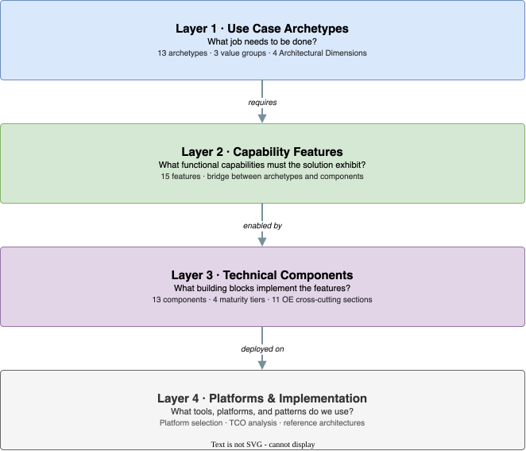

# GenAI & Agentic Architecture Framework

A structured approach for identifying, designing, and implementing Generative AI and Agentic AI capabilities in the enterprise. Designed for architects, developers, and product leaders who need to move from a use case idea to a well-defined, governable system.

{ loading=lazy }

---

## The Four-Layer Model

The framework is organized into four layers that form a natural chain from business need to implementation:

{ loading=lazy }

---

## The Practitioner's Path

Follow these six steps to go from idea to architecture:

-   :material-numeric-1-circle: **Identify your archetype**

    ---

    Which of the 13 archetypes best describes the job to be done? Define your Interaction Model, Autonomy Level, Grounding Strategy, and Governance Posture.

    [:octicons-arrow-right-24: Use Case Archetypes](framework/use-case-archetypes.md)

-   :material-numeric-2-circle: **Map to capability features**

    ---

    Use Matrix A to find which of the 15 capability features your archetype requires. Evaluate whether your context elevates any optional (◐) features to required (●).

    [:octicons-arrow-right-24: Capability Features](framework/capability-features.md)

-   :material-numeric-3-circle: **Identify technical components**

    ---

    Use Matrix B (Features → Components) to find the building blocks that enable your required features. Apply the tier ladder: start at T1, add higher tiers only as needed.

    [:octicons-arrow-right-24: Technical Components](framework/technical-components.md)

-   :material-numeric-4-circle: **Evaluate each component**

    ---

    Apply the Seven Questions (WHY? HOW WELL? WHAT IF? IS IT LEGAL? CAN WE SEE? CAN WE LEARN? CAN WE SHIP?) to confirm each component earns its place.

    [:octicons-arrow-right-24: Component Selection Guide](framework/component-selection-guide.md)

-   :material-numeric-5-circle: **Select tier and platform**

    ---

    Confirm your implementation tier (T1–T4). Choose a platform that fits your organizational context, cloud strategy, and TCO target.

    [:octicons-arrow-right-24: Implementation Tiers](framework/implementation-tiers.md) · [:octicons-arrow-right-24: Platform Selection](framework/platform-selection.md)

-   :material-numeric-6-circle: **Govern with NIST RMF**

    ---

    Complete MAP, MEASURE, MANAGE, and GOVERN sections. Pass the Data Readiness Gate. Verify the Architecture Definition of Done (12-item checklist).

    [:octicons-arrow-right-24: Archetypes → Part 5](framework/use-case-archetypes.md)

---

## Quick Start: T2 Knowledge Assistant

The most common GenAI deployment is a RAG-based knowledge assistant. Start here if that's what you're building.

!!! tip "Minimum viable path — Grounded Q&A (Archetype #3, Tier T2)"

    **Required features:** F1 Contextual Grounding · F4 Interactive Refinement · F5 Citation & Provenance · F12 Safety Controls · F13 Learning & Feedback

    **Core components:** Foundation Model · Prompting · RAG Pipeline · Vector DB · Output Processing · Context Management · Conversation Memory · Safety & Guardrails · Evaluation · Observability

    **Before you build:** Run the [Data Readiness Gate](framework/use-case-archetypes.md) — confirm your knowledge corpus is accessible, authoritative, and in parseable format.

    **Build sequence:** RAG pipeline → conversation memory → citation tracking → safety guardrails → evaluation pipeline → feedback collection

    [:octicons-arrow-right-24: Full framework walkthrough](framework/index.md)

---

## Downloads

| Asset | Description |
|-------|-------------|
| [:material-file-powerpoint: Framework Deck (PPTX)](framework/assets/downloads/agentic-architecture-framework-20260306.pptx) | Slide deck covering all framework layers — suitable for stakeholder presentations |
| [:material-file-excel: Formatted Charts (XLSX)](framework/assets/downloads/formatted-charts.xlsx) | Archetype, feature, and component matrices in spreadsheet form |

---

## Quick Reference

Condensed one-page references for each framework layer:

- [Archetypes Quick Reference](reference/archetypes.md) — 13 archetypes with features at a glance
- [Capability Features Quick Reference](reference/capability-features.md) — 15 features with patterns and archetypes
- [Technical Components Quick Reference](reference/technical-components.md) — component catalog with OE requirements
